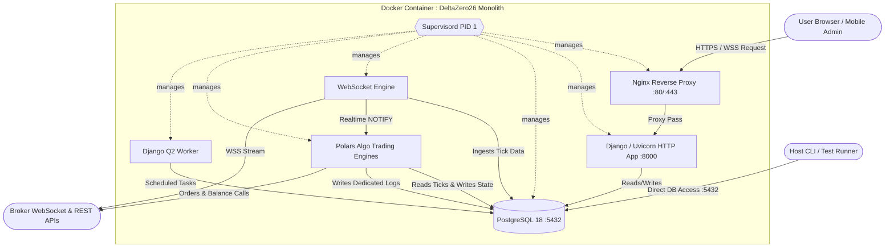

# System Architecture

DeltaZero26 is designed with a monolithic architecture containerized within Docker. This architectural choice is explicitly tailored for deployment on **resource-constrained cloud instances**, minimizing the overhead typically associated with orchestrating multiple microservices.

---

## Overview

The entire application stack—web server, database, message queues, and background engines—runs inside a single Docker container. While unconventional for large-scale enterprise deployments, this approach dramatically reduces RAM and CPU usage, making it ideal for cost-effective hosting without sacrificing necessary features.

---

## Process Management (`supervisord`)

To run multiple processes within a single Docker container, the application utilizes `supervisord`. As defined in [`supervisord.conf`](../supervisord.conf), supervisor acts as the primary PID 1 process and manages the lifecycles of all sub-services via an internal Unix domain socket (`/var/run/supervisor.sock`), enabling status inspection via `supervisorctl`:

1. **`postgresql` (Priority 10):** The primary database instance (PostgreSQL 18.6), initialized via `pg_entrypoint.sh` with `max_connections = 100`.
2. **`django` (Priority 20):** The main web application served via `uvicorn` (ASGI). Waits for PostgreSQL to accept queries using `wait_for_postgres.py` (`pg_isready`), executes `manage.py migrate`, and serves HTTP/WebSocket endpoints on port 8000.
3. **`ws_engine` (Priority 25):** The asynchronous WebSocket client engine (`run_ws_engine`) that maintains persistent connections to broker APIs (Zerodha, Kotak Neo, CoinDCX, CoinSwitch PRO) for real-time tick data using `asyncio` and `asyncpg` with zero CPU idle footprint.
4. **`django_q` (Priority 25):** The Django Q2 worker cluster that handles background tasks, automated daily log pruning (`clear_old_logs`), tick store maintenance (`clear_old_ticks`) using **throttled chunked batch deletions** (`chunk_size=5000`, `sleep=0.05s`) to prevent CPU spikes and table lock contention, and time-based schedule evaluations.
5. **`algo_engine` (Priority 25):** The algorithmic trading engine (`run_algo_engine`) that executes active Pure Polars strategy engines in strict **synchronous sequential order every 2.0 seconds**:
   - **`indian_opt_trde_polars.py`**: Unified strategy execution engine for all Indian exchange brokers (Zerodha Kite, Kotak Neo), supported by modular market timing, SIMD candle resampling, and strike engines.
   - **`crypto_opt_trde_polars.py`**: Unified 24/7/365 continuous trading engine for all Crypto exchange brokers (CoinSwitch PRO, Delta Exchange), segregated from Indian clearing hours.
   - **Cross-Broker Token Mapping Layer (`broker_token_mapper.py`)**: Centralized instrument normalization layer translating canonical instrument keys (`CanonicalInstrumentKey`), derivative contracts, and index aliases (`INDEX_ALIASES`) across Zerodha, Kotak Neo, Delta Exchange, and CoinSwitch PRO.
   - **Broker Utilities Offloading & Config-Aware Recovery**: Spreadsheet loading (`load_indian_algo_config`, `load_crypto_algo_config`) and contract normalization (`master_tkn_list`) are offloaded to broker utilities (`zerodha_utils.py`, `kotak_utils.py`, `coinswitch_utils.py`, `delta_utils.py`) backed by `polars_excel.py`, featuring dynamic cache invalidation and `Capital_share` synchronization.
6. **`nginx` (Priority 30):** The reverse proxy web server. It handles incoming HTTP/HTTPS traffic on ports 80/443, performs SSL termination (using Certbot certificates or self-signed fallbacks), applies rate limits, and routes traffic to Uvicorn.

---

## Service Interaction Flow

---

## Security Architecture & Defenses

- **Standard Django Security Stack**: Utilizes built-in `SecurityMiddleware`, `CsrfViewMiddleware`, `AuthenticationMiddleware`, and `XFrameOptionsMiddleware` (`SAMEORIGIN`).
- **Dedicated M2M Authentication (`M2M_SERVER_KEY`)**: Machine-to-Machine export endpoints (`/api/export/*`) use a dedicated `M2M_SERVER_KEY` header (`X-Server-Key` / `Authorization: Bearer <KEY>`) compared via constant-time comparison (`secrets.compare_digest`), isolating programmatic export access from Django's core `SECRET_KEY`.
- **Strict TLS Certificate Verification**: All outbound remote synchronization calls enforce verified HTTPS via `SSL_VERIFY` (`requests.get(..., verify=SSL_VERIFY)`), eliminating MitM attack vectors.
- **Strict OAuth State Nonce Verification**: Every OAuth login initiation generates a cryptographically secure 32-byte state token (`secrets.token_urlsafe(32)`). The callback handler strictly aborts execution upon any mismatch, preventing OAuth login CSRF attacks.
- **Privileged Access Control**: Sensitive management endpoints (e.g. `broker_login_view`, `default_totp_view`, `export_algo_logs_view`, `fetch_remote_data_view`) are protected via `@staff_member_required`.
- **Credential Protection in Data Exports**: The `export_models_api` endpoint strictly limits serialization to `kalai.AlgoInfo`, preventing plaintext API secrets, MPINs, or TOTP keys from being dumped over API endpoints.
- **SQL Injection Prevention**: Raw Postgres COPY bulk exports use `psycopg.sql.SQL` parameterization with bounded interval parsing (`make_interval(hours => %s)`).
- **Admin UI Masking**: Passwords and secrets (`api_secret`, `totp_secret`, `refresh_token`, `api_key`) use masked inputs and truncated hash codes to prevent browser DOM caching and shoulder-surfing.
- **Reverse Proxy Hardening**: Nginx enforces TLS 1.2/1.3, HSTS (`max-age=31536000`), dynamic request rate limiting (`rate=50r/s burst=100 nodelay` with RFC 429 status), connection flood capping (`limit_conn conn_limit 50`), static asset caching (`max-age=86400`), tuned proxy buffers (`16k/32k`), and server version suppression.
- **Host Memory & ZRAM Compression**: Host systems utilize `zram-tools` (`zstd` compression, 60% RAM allocation, `vm.swappiness=100`, `vm.page-cluster=0`) for in-RAM compressed memory paging without physical disk I/O bottlenecks.

---

## Key System Interactions

- **Data Ingestion & Partitioning:** The `WSEngine` process maintains live WebSocket connections to broker feeds (Zerodha, Kotak Neo, CoinDCX, CoinSwitch PRO). Ticks are stored via binary `COPY` into partition tables and normalized in `ProcessedTickStore`.
- **Compound Composite Indexing:** `ProcessedTickStore` is indexed via composite `(account, -timestamp)` and `(account, timestamp)` B-tree indexes, ensuring instant sub-millisecond execution when strategy engines query recent tick histories every 2.0s.
- **Pure Polars Vector Operations:** All candle math, Heikin-Ashi conversions, multi-timeframe resamplers, and Excel config ingestion run on native **Polars + openpyxl** with zero Pandas dependency.
- **Real-time Signaling (`pg_notify`):** DeltaZero26 utilizes PostgreSQL's `NOTIFY`/`LISTEN` mechanism for inter-process communication. When a broker record is modified in Django Admin, a `NOTIFY` signal is received by `WSEngine` and `AlgoEngine` to trigger instant live reloads.
- **State & Log Separation:**
  - **`AlgoInfo` (`kalai_algoinfo`)**: Stores live subscribed instrument tokens (`{account_id}_inst_tokens`), strategy configurations, pre-computed `cum_table` contract universes for instant zero-download crash recovery, and candle buffers. Backed by composite database indexes `(account, tablename)` for instant sub-millisecond retrieval.
  - **Lean Memory Lifecycle**: Temporary 6-exchange master contract tables are discarded immediately post-assembly (`gc.collect()`), maintaining a lean **~25–32 MB active heap** for `AlgoEngine`.
  - **`AlgoLog` (`kalai_algolog`)**: Dedicated database model and table storing structured algorithm execution logs with ISO timestamps (`[{datetime.now().isoformat()}]`), full search and filtering capabilities in Django Admin, and multi-sheet Excel export utilities via `polars_excel.py`.
