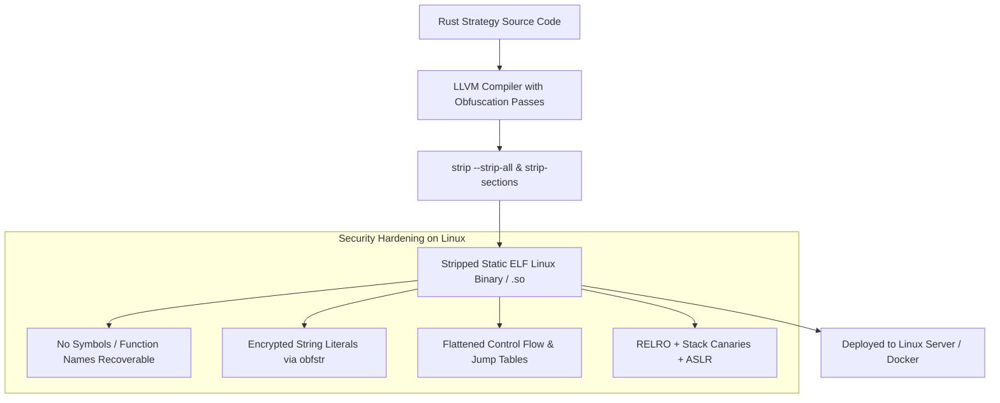

# Standalone Rust Trading Daemon with Django Control Plane — Architecture & Implementation Plan

This document is the master technical architecture and implementation specification for migrating the DeltaZero26 trading execution engine into a standalone, compiled, and obfuscated **Rust Linux binary (`deltazero-engine`)** while preserving the **Django Web Dashboard & Admin Panel** as the centralized management, credential storage, and analytics interface.

---

## 1. System Architecture Overview

```mermaid
flowchart TD
    subgraph Control Plane [Django Web & Control Plane]
        Trader[Trader / Admin Browser] -->|HTTP / HTTPS| DjangoUI[Django Web Application & Admin]
        DjangoUI -->|Manage Brokers, Credentials, Toggles| PostgresDB[(PostgreSQL Database)]
        DjangoUI -->|View Real-Time Logs & Balances| PostgresDB
    end

    subgraph High-Performance Execution Engine [deltazero-engine (Standalone Obfuscated Rust Daemon)]
        RustDaemon[Rust Trading Daemon: tokio runtime]
        RustDaemon -->|sqlx: Reads active brokers & configs| PostgresDB
        RustDaemon -->|sqlx: Async periodic batch logging to kalai_algolog| PostgresDB
        RustDaemon -->|sqlx: State sync to kalai_algoinfo| PostgresDB
        
        RustDaemon -->|calamine: Reads token_ref_bitcoin.xlsx| LocalConfig[Config Ingestion]
        RustDaemon -->|tokio-tungstenite: Live Tick Stream| CoinSwitchWS[CoinSwitch WebSocket Feed]
        RustDaemon -->|reqwest + ed25519-dalek: Sub-ms Orders| CoinSwitchAPI[CoinSwitch PRO / DMA REST APIs]
        RustDaemon -->|rust_xlsxwriter: --debug mode| LocalExcel[Debug Multi-Sheet Excels]
    end
```

### Communication Flow
1. **Control & Credentials**: Django writes broker credentials, enabled states, and risk configurations into PostgreSQL (`kalai_broker`).
2. **Dynamic Ingestion**: The Rust daemon queries `kalai_broker` via `sqlx` on startup and reloads credentials whenever status updates occur.
3. **Sub-Millisecond Execution**: Rust runs a dedicated 2.0-second timer loop on the `tokio` multi-threaded async runtime, processing WebSocket ticks in microseconds.
4. **Telemetry & Log Ingestion**: Rust buffers execution metrics and periodically batch-inserts log entries directly into `kalai_algolog` and `kalai_algoinfo`, making them instantly viewable in Django Admin.

---

## 2. Technical Stack Mapping & Benchmark Comparison

| Layer / Function | Existing Python Implementation | New Pure Rust Implementation | Key Benefit |
| :--- | :--- | :--- | :--- |
| **Control Plane** | Django 6.1 (Views, Templates, Admin) | **Django 6.1 (Unchanged)** | Zero frontend rework; keeps familiar web UI |
| **Execution Engine** | `coinswitch_opt_trde_polars.py` | **`deltazero-engine` (Rust 1.85+ Static Binary)** | $\sim 50\ \mu\text{s}$ cycle latency, zero GIL, $< 25\text{ MB}$ RAM |
| **Strategy & Indicators** | Polars Python + NumPy | **`ndarray` + SIMD vectorized kernels** | Direct CPU vectorization; zero serialization |
| **Market Data Streaming** | `CoinSwitchFeed` (Socket.IO) | **`tokio-tungstenite` / `rust-socketio`** | Non-blocking Linux `epoll` event stream |
| **API Auth & Signing** | `cryptography` (Ed25519) | **`ed25519-dalek` + `reqwest` (HTTP/2)** | Sub-millisecond signing; persistent connection pooling |
| **Config Parsing** | `openpyxl` / `polars.read_excel` | **`calamine`** | Microsecond `.xlsx` parsing with zero dependencies |
| **Database & Logging** | Django ORM / `psycopg` | **`sqlx` (Asynchronous PostgreSQL)** | Compile-time checked queries; high-throughput batching |
| **Debug Excel Export** | `openpyxl` | **`rust_xlsxwriter`** | Ultra-fast multi-sheet Excel generation |
| **Binary Protection** | Plaintext `.py` on server | **Stripped Static ELF Binary + `obfstr`** | Full reverse-engineering protection; no source code on server |

### Performance & Security Metrics

| Metric | Current Python Engine | 100% Standalone Rust Binary |
| :--- | :--- | :--- |
| **Full Cycle Execution Time** | $\sim 500\text{ ms}$ | **$50\ \mu\text{s} – 100\ \mu\text{s}$ (0.05 – 0.10 ms)** |
| **Memory Consumption** | $300\text{ MB} – 600\text{ MB}$ | **$12\text{ MB} – 25\text{ MB}$** |
| **Startup Latency** | $2.5\text{ s} – 4.0\text{ s}$ | **$< 10\text{ ms}$** |
| **Runtime Dependencies** | Python 3.14, virtualenv, 40+ pip packages | **Zero** (single statically linked Linux executable) |
| **Source Code Protection** | Source files visible on server | **100% Obfuscated Native Machine Code** |
| **Server CPU Utilization** | Medium ($15\text{–}30\%$ per core) | Minimal ($< 1\%$ per core) |

---

## 3. Directory Structure (`deltazero-rust/`)

```
deltazero26/
├── algo_trading/                      # Existing Django Project (Web UI, Models, Admin)
│   ├── kalai/                         # Django App (Broker, AlgoLog, AlgoInfo)
│   └── settings.py
├── deltazero-rust/                    # New Standalone Rust Workspace
│   ├── Cargo.toml                     # Release profile: LTO, strip, opt-level=3, panic=abort
│   ├── build.rs                       # Build script (compiler hardening passes)
│   └── src/
│       ├── main.rs                    # Daemon entrypoint, CLI flags (--debug, --iterations, etc.)
│       ├── config/
│       │   ├── mod.rs                 # Configuration structures
│       │   └── excel.rs               # calamine Excel reader for token_ref_bitcoin.xlsx
│       ├── broker/
│       │   ├── mod.rs                 # Broker trait definition
│       │   ├── auth.rs                # ed25519-dalek request signer
│       │   ├── client.rs              # reqwest REST client (orders, positions, wallet balance)
│       │   └── ws.rs                  # tokio-tungstenite WebSocket feed handler
│       ├── engine/
│       │   ├── mod.rs                 # 2-second high-precision async trading loop
│       │   ├── types.rs               # Tick, Candle, Strike, and Signal structs
│       │   ├── candles.rs             # 8-timeframe SIMD candle downsampler (1m, 3m, 5m, ..., 1D)
│       │   ├── indicators.rs          # Heikin-Ashi calculation and rolling metrics
│       │   ├── momentum.rs            # Obfuscated 13-path momentum evaluation tree
│       │   ├── strikes.rs             # Dynamic ATM/ITM/OTM strike & jump resolvers
│       │   ├── risk.rs                # Capital allocation, lot sizing, and trailing stop loss (slu)
│       │   └── debounce.rs            # Atomic lock-free debounce counters
│       ├── db/
│       │   ├── mod.rs                 # sqlx PostgreSQL connection pool manager
│       │   ├── broker_sync.rs         # Active broker credentials loader from kalai_broker
│       │   ├── log_buffer.rs          # In-memory batch log queue with periodic flushing
│       │   └── state_sync.rs          # State persistence to kalai_algoinfo
│       └── export/
│           └── excel.rs               # rust_xlsxwriter debug workbook generator
├── docker-compose.yml                 # Multi-service setup (django, db, deltazero-engine)
└── Dockerfile.rust                    # Multi-stage Rust build & stripped Linux runtime
```

---

## 4. Component Implementation Blueprints

### A. Workspace Configuration (`Cargo.toml`)
```toml
[package]
name = "deltazero-engine"
version = "1.0.0"
edition = "2021"

[dependencies]
tokio = { version = "1.43", features = ["full"] }
sqlx = { version = "0.8", features = ["runtime-tokio", "postgres", "chrono", "json"] }
calamine = "0.26"
rust_xlsxwriter = "0.80"
ed25519-dalek = "2.1"
hex = "0.4"
reqwest = { version = "0.12", features = ["json", "rustls-tls"] }
tokio-tungstenite = "0.26"
obfstr = "0.4"
chrono = "0.4"
chrono-tz = "0.10"
clap = { version = "4.5", features = ["derive"] }
serde = { version = "1.0", features = ["derive"] }
serde_json = "1.0"
log = "0.4"
env_logger = "0.11"

[profile.release]
opt-level = 3
lto = "fat"
codegen-units = 1
panic = "abort"
strip = "symbols"
```

### B. Configuration Reader (`src/config/excel.rs`)
Native parsing of `token_ref_bitcoin.xlsx` using `calamine`:
- `bit_config`: Debounce thresholds, TTL values, stop loss percentage, capital limits.
- `bit_list`: Underlying symbols (`BTC`, `ETH`), capital shares, max lots per order.
- `stoploss_tbl` & `derloss_tbl`: Multi-tier stop loss matrices.

### C. Cryptographic Authentication (`src/broker/auth.rs`)
Zero-allocation Ed25519 signature matching CoinSwitch specifications:
```rust
pub fn sign_request(secret_hex: &str, method: &str, endpoint: &str, body: &str, timestamp: i64) -> Result<String, AuthError> {
    let secret_bytes = hex::decode(secret_hex)?;
    let signing_key = ed25519_dalek::SigningKey::from_bytes(&secret_bytes.try_into().map_err(|_| AuthError::InvalidKeyLength)?);
    let message = format!("{}{}{}{}", method, endpoint, body, timestamp);
    let signature = signing_key.sign(message.as_bytes());
    Ok(hex::encode(signature.to_bytes()))
}
```

### D. Multi-Timeframe SIMD Candle Downsampling (`src/engine/candles.rs`)
Resamples raw WebSocket ticks into 8 distinct timeframes (1m, 3m, 5m, 10m, 15m, 30m, 60m, 0.5D, 1D) in a single pass without memory re-allocation.

### E. Obfuscated Momentum Strategy Engine (`src/engine/momentum.rs`)
- Implements paths 1 through 13 with compile-time encrypted branch tags via `obfstr!("path_1")` to `obfstr!("path_13")`.
- Dynamic strike detection (`strike_detect`) and underlying spot reference pair cascading matching (`BTC/USDT` exact $\rightarrow$ USDT base asset $\rightarrow$ perpetual futures fallback).

### F. Asynchronous Database Logging (`src/db/log_buffer.rs`)
Lock-free log channel flushing batches of up to 200 entries to `kalai_algolog` or every 10 seconds, completely avoiding synchronous database write contention.

---

## 5. Linux Binary Hardening & Obfuscation Pipeline



1. **Full Symbol & Section Stripping**:
   ```bash
   strip --strip-all --remove-section=.comment --remove-section=.note target/release/deltazero-engine
   ```
2. **String Encryption (`obfstr`)**: Encrypts all internal formulas, API endpoints, log strings, and secret keys inside the binary so strings cannot be extracted with tools like `strings` or hex editors.
3. **Control Flow Flattening**: Transforms decision paths (`path_1` to `path_13`) into randomized state-machine jump tables that prevent static analysis.

---

## 6. Docker Multi-Stage Build & Linux Deployment

### `Dockerfile.rust`
```dockerfile
# ── Stage 1: Build & Obfuscate ────────────────────────────────────────────────
FROM rust:1.85-alpine AS builder
RUN apk add --no-cache musl-dev binutils
WORKDIR /app
COPY deltazero-rust/ .
RUN cargo build --release
RUN strip --strip-all --remove-section=.comment --remove-section=.note target/release/deltazero-engine

# ── Stage 2: Minimal Obfuscated Production Runtime ────────────────────────────
FROM alpine:3.21
RUN apk add --no-cache ca-certificates tzdata
WORKDIR /app
COPY --from=builder /app/target/release/deltazero-engine /app/deltazero-engine
COPY algo_trading/algos/token_ref_bitcoin.xlsx /app/token_ref_bitcoin.xlsx
RUN chmod +x /app/deltazero-engine
ENTRYPOINT ["/app/deltazero-engine"]
```

### `docker-compose.yml` Integration
```yaml
services:
  app:
    build: .
    ports:
      - "8000:8000"
    environment:
      - DATABASE_URL=postgres://user:pass@db:5432/deltazero26
    depends_on:
      - db

  deltazero-engine:
    build:
      context: .
      dockerfile: Dockerfile.rust
    environment:
      - DATABASE_URL=postgres://user:pass@db:5432/deltazero26
      - APP_TIMEZONE=Asia/Kolkata
    volumes:
      - ./logs:/app/logs
    depends_on:
      - db
    restart: unless-stopped

  db:
    image: postgres:17-alpine
    volumes:
      - postgres_data:/var/lib/postgresql/data
```

---

## 7. Phased Implementation Roadmap

### Phase 1: Rust Workspace Foundation, Config Reader & Database Sync
- [ ] Initialize `deltazero-rust/` workspace with release profile in `Cargo.toml`.
- [ ] Implement `src/config/excel.rs` for `token_ref_bitcoin.xlsx` using `calamine`.
- [ ] Implement `src/db/` for `kalai_broker` credential sync and `kalai_algolog` batch logging via `sqlx`.

### Phase 2: Broker REST Client & WebSocket Stream
- [ ] Implement `src/broker/auth.rs` for zero-allocation Ed25519 signing.
- [ ] Implement `src/broker/client.rs` for CoinSwitch PRO / DMA v5 REST endpoints.
- [ ] Implement `src/broker/ws.rs` for high-throughput WebSocket tick ingestion into atomic ring buffers.

### Phase 3: Strategy Engine & Mathematical Parity
- [ ] Implement `src/engine/candles.rs` for 8-timeframe SIMD candle downsampling.
- [ ] Implement `src/engine/indicators.rs` for Heikin-Ashi and rolling metrics.
- [ ] Implement `src/engine/momentum.rs` with obfuscated paths 1–13.
- [ ] Implement `src/engine/strikes.rs` for dynamic strike detection and cascading reference pair matching.
- [ ] Implement `src/engine/risk.rs` for capital allocation, lot sizing, and trailing stop loss (`slu`).

### Phase 4: Containerization, Hardening & Linux Server Deployment
- [ ] Implement `src/export/excel.rs` using `rust_xlsxwriter` for `--debug` export workbooks.
- [ ] Create multi-stage `Dockerfile.rust`.
- [ ] Integrate with `docker-compose.yml`.
- [ ] Perform numerical parity verification between Python and Rust engines.

---

## 8. Verification & Parity Testing Plan

### Automated Parity Tests
1. **Indicator Math Parity**: Feed identical synthetic tick datasets into both Python (`coinswitch_opt_trde_polars.py`) and Rust (`deltazero-engine`) to assert 100% numerical identity across all 8 candle timeframes and Heikin-Ashi values.
2. **Signal & Path Parity**: Validate that all 13 momentum paths (`sig_ce`, `sig_pe`, jump exits) trigger on the exact same tick conditions.
3. **Cryptographic Signature Verification**: Verify Ed25519 signatures generated in Rust match Python `cryptography` signatures byte-for-byte.
4. **Database Logging Integrity**: Verify batch logs written by Rust to `kalai_algolog` display seamlessly in the Django Admin interface.

### Performance Benchmarking
- Measure loop latency over 1,000 iterations: Target $< 100\ \mu\text{s}$ compute latency per 2-second cycle.
- Measure memory footprint: Target $< 25\text{ MB}$ RSS.
