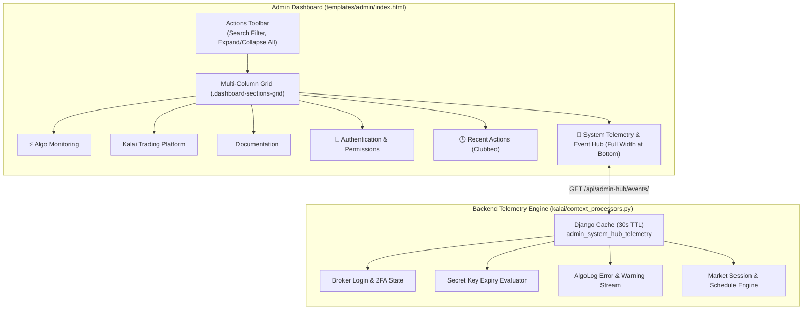

# Django Admin Dashboard & Live Telemetry Event Hub

The DeltaZero26 Django Admin home page (`/d4f8g9h2j1m5k8p3/`) provides a centralized operational workstation for monitoring algorithms, broker credentials, market sessions, and execution logs.

---

## 1. Architectural Highlights

---

## 2. Collapsible Sections Grid

All dashboard modules are organized into a responsive, fluid multi-column grid (`.dashboard-sections-grid`):

- **Section 1: ⚡ Algo Monitoring** (`#sec-algo-monitoring`): Direct access to Algorithm Status Monitor, Positions & P&L Analytics, Data Hub, Deployment Hub, and Candle Visualizer.
- **Section 2: Kalai Trading Platform** (`#sec-app-kalai`): Database models for Accounts, Exchange Masters, Processed Ticks, Algo Logs, Positions, Trades, and Daily P&L.
- **Section 3: 📘 Documentation** (`#sec-documentation`): Direct access to Multi-Broker Setup & Credential Mapping Guide.
- **Section 4: 🔐 Authentication & Permissions** (`#sec-app-auth`): User accounts and groups.
- **Section 5: 🕒 Recent Actions** (`#sec-recent-actions`): Clubbed directly into the grid as a native collapsible card, replacing the legacy right-hand sidebar and eliminating dead margins.

### Key Capabilities
- **Persistent State**: Expand/collapse state is stored in browser `localStorage` (`deltazero_admin_collapsed_sections`) and restored before DOM paint to ensure zero layout flicker.
- **Real-Time Search Filter**: Typing into the toolbar search box instantly filters models and tools across all sections, auto-expanding sections containing matches.
- **Global Toggles**: One-click `Expand All` and `Collapse All` buttons in the toolbar.
- **Responsive Fluid Layout**: Adapts automatically from 1 column on tablets/mobile to 2 columns on 1300px+ displays and 3 columns on 1800px+ monitors.

---

## 3. Live System Telemetry & Event Hub

Positioned at the bottom of the dashboard across the full width of the screen, the **System Telemetry & Event Hub** (`#systemHubModule`) provides comprehensive live operational visibility:

### Status Beacon
- 🟢 **Systems Operational**: All brokers authenticated, no expired credentials, zero critical errors.
- 🟡 **Warnings Present**: Impending key expiries, missing daily login tokens, or non-fatal warning logs.
- 🔴 **Critical Attention**: Expired API keys or active execution errors in `AlgoLog`.

### Interactive Tabs
1. **📌 All Events**: Consolidated chronological feed of all active alerts, pending logins, and errors.
2. **🔑 Key Expiries**: Tracks API secret key validity (e.g. CoinSwitch PRO 90-day policy), displaying remaining days, expiration dates, and a direct `Renew Key →` action button.
3. **🔐 Broker Logins & 2FA**: Real-time authentication status for all active accounts:
   - Identifies brokers with active daily session tokens vs expired tokens requiring daily 2FA login.
   - Provides direct 1-click `Authorize / 2FA →` link to `/broker-admin/broker-login/`.
4. **⚠️ Errors & Warnings**: Surfaces the 15 most recent `ERROR` and `WARNING` entries from `AlgoLog` within the past 48 hours with human-readable relative timestamps (`5m ago`, `2h ago`).
5. **📅 Market Schedules**: Live operational status across all supported exchanges:
   - **Indian Equities & Options (NSE / BSE / NFO)**: 09:15 - 15:30 IST (Mon - Fri).
   - **MCX Commodities**: 09:00 - 23:30 IST (Mon - Fri).
   - **Crypto Markets (CoinSwitch PRO & Delta Exchange)**: 24/7/365 continuous trading.
   - **Daily Master Token Synchronizer**: Scheduled daily at 08:45:00 IST.

### Controls
- **`🔄 Refresh` Button**: Asynchronously calls `/api/admin-hub/events/?force=1` to update telemetry on demand without a full page reload.
- **`Minimize / Expand`**: Collapses the telemetry body to save vertical space; state persists in `localStorage` (`deltazero_admin_hub_minimized`).

---

## 4. Security & Performance Hardening

### Security Defenses
- **Credential Masking (`_mask_sensitive_data`)**: Automatically strips API keys, API secrets, TOTP seeds, passwords, and authorization bearer tokens from all rendered error messages and event payloads (`***MASKED***`).
- **Role-Based Access Control**:
  - Context processor `admin_system_hub` returns empty telemetry for unauthenticated or non-staff users.
  - Endpoint `/api/admin-hub/events/` is protected with `@staff_or_token_required`, rejecting unauthorized calls with HTTP `401 Unauthorized` or `403 Forbidden`.

### Performance Guarantees
- **In-Memory Caching (30s TTL)**: Server-side data is cached in memory (`admin_system_hub_telemetry`), providing instant sub-millisecond page loads on repeated navigation and zero database query spam.
- **Compound Indexed Queries**: `AlgoLog` queries strictly leverage the composite index `(-timestamp)` and cap retrieval at 15 items.
- **Eager Loading**: Broker queries use `.select_related("broker_name", "api_provider")` to eliminate N+1 overhead.

---

## 5. Mobile Ergonomics & Responsive Architecture

The admin panel and operational hubs are fully optimized for mobile devices (smartphones with screen widths 360px–430px and tablets up to 768px):

### Central Mobile Stylesheet (`kalai/static/kalai/css/admin_mobile.css`)
- **Lightweight Vanilla CSS**: Zero external frameworks, zero CDN requests, and sub-10KB payload ensure lightning-fast rendering even on spotty mobile cellular connections.
- **Touch-First Hitboxes**: Enforces minimum $\ge 40\text{px} - 44\text{px}$ touch targets across buttons, filters, pagination links, and form actions to eliminate tap frustration.
- **iOS Safari Auto-Zoom Prevention**: Sets `font-size: 16px !important` on all text, search, number, and password inputs on screens $< 768\text{px}$, preventing browser auto-zoom upon tapping input fields.
- **Safe Area Insets**: Integrates `calc(8px + env(safe-area-inset-bottom, 0px))` for bezel-less devices with home indicators.

### Two-Row Responsive Header & Momentum Breadcrumbs
- **Two-Row Responsive Header**: On screens $\le 767\text{px}$, `#header` flexes vertically into a structured two-row column (`flex-direction: column !important; align-items: stretch !important; height: auto !important;`):
  - **Row 1 (`#branding`)**: Full-width row displaying the DeltaZero site title, live status, and compact action badges (`TOTP` and `Login`).
  - **Row 2 (`#user-tools`)**: Full-width row with subtle top hairline border (`border-top: 1px solid rgba(255, 255, 255, 0.1)`) and float resets, clearly displaying user utility links (**"VIEW SITE"**, **"CHANGE PASSWORD"**, **"LOG OUT"**) with touch-safe tap targets.
- **Search Toolbar Clearance**: `.admin-toolbar-row` enforces guaranteed vertical margins (`margin-top: 12px !important; margin-bottom: 16px !important;`), ensuring at least $+45\text{px}$ of clear separation so the quick-filter search box (`#adminFilterInput`) never visually or functionally collides with user utility links.
- **Single-Line Breadcrumbs**: Breadcrumbs utilize a smooth horizontal momentum-scrolling container (`-webkit-overflow-scrolling: touch; white-space: nowrap;`) with hidden scrollbars, preventing multi-line text wrapping.

### Fluid Grid & Touch-Friendly Cards
- **Overflow Prevention**: Replaced fixed minimums (`minmax(420px, 1fr)`) with `minmax(min(100%, 360px), 1fr)`, eliminating horizontal page blowout on 360px–414px smartphone screens.
- **Model Rows as Flex Cards**: On mobile screens, model tables inside collapsible sections render as clean touch-friendly rows with distinct `View` and `+ Add` pill badges.
- **Telemetry Event Stacks**: Multi-column telemetry event rows stack vertically into clean cards (Top: Icon + Title + Status; Middle: Message; Bottom: Timestamp & action link).

### Sticky Floating Submit Row (`change_form`)
- Replaced the vertical stack of 5 full-width buttons (which previously consumed 220px+ of screen space) with a compact, theme-aware floating action bar.
- The primary **Save** button takes priority flex allocation, while secondary buttons wrap neatly alongside.
- Extra bottom clearance padding ensures form inputs at the bottom of the page can be scrolled past the sticky bar without obstruction.

### Workstation Adaptations (`algo_status`, `positions_pnl`, `deployment_hub`)
- **2-Column KPI Cards**: Replaced wide horizontal strips with compact, thumb-friendly 2x2 grids (`repeat(2, 1fr)`).
- **Stacked Filters**: Form filters and action buttons stack neatly with full-width tap targets.
- **Horizontal Table Scrolling**: Wide data tables are wrapped in smooth touch-scrolling wrappers (`-webkit-overflow-scrolling: touch`), preventing viewport distortion.

