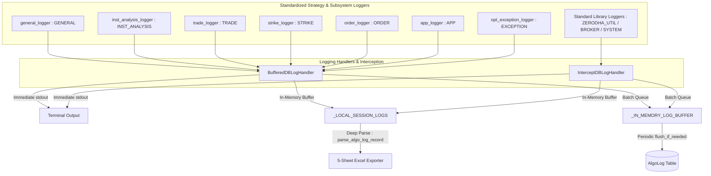

# Algorithmic Trading Engine

The Algorithmic Trading Engine is a background service responsible for executing trading logic based on market data. It handles scheduling, state management, multi-account order routing, and the cyclical execution of registered trading strategies across multiple broker accounts.

---

## 1. Architecture & Execution Flow

```mermaid
flowchart TD
    subgraph AlgoEngine [Algo Engine Daemon : Sequential Loop (Every 2.0s)]
        DB[(PostgreSQL Database)]
        Registry[Static Algo Registry : load_all_algos]
        
        Runner(Synchronous Sequential Runner : run_algos_sequential)
        
        Runner -- Resolves Enabled Accounts --> DB
        Runner -- Loads Registered Strategies --> Registry
        
        subgraph SequentialPipeline [Sequential Execution per Account]
            direction TB
            Step1(1. Zerodha Options Polars Engine)
            Step2(2. Kotak Neo Options Polars Engine)
            Step3(3. CoinSwitch Crypto Polars Engine)
            Step4(4. Delta Exchange Crypto Polars Engine)
            
            Step1 --> Step2 --> Step3 --> Step4
        end
        
        Runner --> SequentialPipeline
        
        Step1 -- Ingests Ticks via Index Scan --> DB
        Step1 -- Reads Config via polars_excel --> ExcelFile[token_ref.xlsx]
        Step1 -- Syncs Balances & Positions --> Utils[ZerodhaUtility]
        Step1 -- Updates Subscriptions & State --> DB
        
        SequentialPipeline -- Single Batch Log Flush per Cycle --> DB
    end
```

---

## 2. Code Flow: Under the Hood

The execution logic is defined within `algo_trading/brokers/algo_engine.py` by `run_engine_sequential()`.

### A. Sequential Execution Model (`run_algos_sequential`)
Unlike concurrent asyncio task architectures that suffer from context-switching overhead, asyncpg connection pool contention, and unpredictable task preemption, DeltaZero26 uses a **deterministic synchronous sequential execution pipeline**:
- **Loop Interval (`ALGO_LOOP_INTERVAL_SECONDS=2.0`)**: The engine executes one synchronous sweep across all active accounts and registered strategies every 2.0 seconds.
- **Account Filtering & 24/7 Crypto Scheduling (`is_account_active`)**:
  - **24/7 Crypto Operation**: Cryptocurrency accounts (`broker.is_crypto = True`, e.g. Delta Exchange, CoinSwitch PRO, CoinDCX) trade 24/7/365 without schedule constraints or overnight pauses.
  - **Explicit Schedule Bypass**: Accounts with `enable_schedule = False` run continuously without time bounds.
  - **Market Hours Enforcement**: Indian equity/derivatives accounts with `enable_schedule = True` only execute within configured exchange windows (`ws_start_time` – `ws_stop_time`, weekdays).
- **Error Isolation**: Each strategy execution per account is wrapped in an isolated `try...except` block. A failure in one strategy does not block or terminate subsequent strategies.
- **Batched In-Memory Log Flushing**: Strategy execution logs are buffered in-memory during the cycle and flushed to `kalai_algolog` in a single batch write at the end of each sequential sweep.

### B. Real-time Config Updates (`pg_notify`)
Listens on PostgreSQL channel `algo_control`. When account parameters or tokens are updated in Django Admin, a `NOTIFY` triggers an immediate refresh of active account settings.

---

## 3. Unified Two-Engine Architecture & Broker Utility Offloading

DeltaZero26 features ultra-high-performance, SIMD-vectorized trading engines powered by [Polars](https://pola.rs) for sub-millisecond data processing and zero-copy transformations. The architecture cleanly segregates Indian market operations from 24/7 Crypto markets:

```mermaid
flowchart TD
    subgraph Config_Layer [Configuration & Master Tokens Layer]
        Excel[token_ref.xlsx] -->|polars_excel.py| BU[Broker Utilities]
        BU -->|master_tkn_list| ZU[zerodha_utils.py]
        BU -->|master_tkn_list| KU[kotak_utils.py]
        BU -->|master_tkn_list| CSU[coinswitch_utils.py]
        BU -->|master_tkn_list| DU[delta_utils.py]
    end

    subgraph Execution_Engines [Unified Execution Engines]
        direction TB
        ZU & KU -->|Generic Indian Interface| IndEngine[indian_opt_trde_polars.py<br/><b>Unified Indian Options Engine</b><br/>(NSE, BSE, MCX, NFO, BFO)]
        CSU & DU -->|Generic Crypto Interface| CrypEngine[crypto_opt_trde_polars.py<br/><b>Unified Crypto Engine</b><br/>(24/7/365 Continuous)]
    end

    subgraph Modular_Subsystems [Modular Engine Subsystems]
        IndEngine --> IMS[indian_market_session.py]
        IndEngine --> ICE[indian_candle_engine.py]
    subgraph Modular_Subsystems [Modular Engine Subsystems]
        IndEngine --> IMS[indian_market_session.py]
        IndEngine --> ICE[indian_candle_engine.py]
        IndEngine --> ISE[indian_strike_engine.py]
        IndEngine --> IUA[indian_user_account.py]
        CrypEngine --> CMT[crypto_master_tokens.py]
        CrypEngine --> CUA[crypto_user_account.py]
    end
```

### A. Unified Indian Options Engine (`indian_opt_trde_polars.py`)
A single, modular execution engine supporting all Indian exchange brokers (Zerodha Kite, Kotak Neo, Upstox, Angel One):
- **Exchange Scope**: NSE, BSE, NFO, BFO, MCX, CDS.
- **Dynamic Account Discovery & Factory**:
  - `discover_indian_broker_accounts(target_account_id)` queries active database brokers filtering for `enable_trade = True` across `zerodha`, `kotak`, `kotak_neo`, `upstox`, and `angel`, with per-account fault isolation.
  - `create_indian_broker_utility(broker_obj, account_id)` dynamically instantiates `ZerodhaUtility` or `KotakNeoUtility`.
- **Two-Tier Architecture**:
  - **Tier 1 (Shared Market Processing)**: Vectorized multi-token downsampling across 5 timeframes, Heikin-Ashi indicators, and dynamic ATM strike calculations execute **once globally** per 2-second cycle.
  - **Tier 2 (Per-Account Order Execution)**: Slices capital and manages order books across all discovered active accounts concurrently.
- **Intelligent Account Synchronization**: Reuses freshly synced state from `execute_account_trade()` within `buy_sell_loop()`, eliminating redundant REST round-trips (~130–150ms saved per cycle) and achieving **~0.21s cycle execution times** (faster than standalone Kotak at ~0.27s).
- **Parity Benchmarking**: Produces **100% exact parity** with standalone engines (`kotak_opt_trde_polars.py`):
  - `cum_table`: 6,202 rows, 67 columns, identical tokens, symbols, and strike parameters.
  - Logging & Telemetry: Complete multi-sheet Excel export (`All_Logs`, `Account_Telemetry`, `Trades_&_Orders`, `Errors_&_Warnings`, `Summary`).
- **CLI Targeting (`--account`)**: Supports targeted account execution (e.g. `uv run python algo_trading/algos/indian_opt_trde_polars.py --account W1NPY --debug --iterations 5`).

### B. Unified Crypto Trading Engine (`crypto_opt_trde_polars.py`)
A dedicated, continuous 24/7/365 execution engine for crypto derivatives across multiple exchanges (CoinSwitch PRO, Delta Exchange Global & India, and CoinDCX):
- **Session Independence**: Operates without Indian market session cutoffs, pre-market waits, or evening post-trade resets (`run_24x7_loop`).
- **Modular Subsystem Delegation**: Slices user account encapsulation into standalone [`crypto_user_account.py`](file:///c:/Users/Admin/Documents/deltazero26/algo_trading/algos/crypto_user_account.py) with exact 1:1 structural parity to `indian_user_account.py`.
- **Dynamic Multi-Broker Crypto Discovery & Factory**:
  - `discover_crypto_broker_accounts(target_account_id)` queries active crypto brokers for `coinswitch`, `delta`, `delta_exchange`, `delta_india`, and `coindcx`.
  - `create_crypto_broker_utility(broker_obj, account_id)` dynamically instantiates `CoinSwitchUtility`, `DeltaExchangeUtility`, or `CoinDCXUtility` based on broker code, API provider, or name matching.
- **Dynamic Account Fault Isolation**: Dynamic crypto account creation inside `crypto_options_trading_algo_polars` is guarded by isolated `try...except` exception boundaries. An account with bad credentials or connection timeouts will log a descriptive error without crashing or blocking the global 24/7 loop for other active accounts.
- **Adaptive TTL State Synchronization**: `CryptoUserAccount.sync_account_state` evaluates TTL intervals per endpoint (`holdings_ttl`, `balance_ttl`, `orders_active_ttl` vs `orders_idle_ttl`, `positions_ttl`). It eliminates redundant HTTP REST roundtrips during steady states, slashing cycle duration from ~500ms down to **~10ms–22ms (sub-15ms Polars cycle, ~35x faster)**.
- **Tick Ingestion via `ProcessedTickStore`**: Directly ingests real-time ticks via `fetch_recent_ticks()`, driving 8-timeframe candle downsamplers and continuous strike evaluation.
- **Parity Benchmarking**: Produces **100% exact parity** with standalone Delta engine (`delta_opt_trde_polars.py`):
  - `cum_table`: 568 rows, 45 columns, identical tokens, symbols, and underlying mappings (`BTC`, `ETH`, `SOL`, `XRP`, `DOGE`).
  - Crash Recovery: Restores pre-computed `cum_table` directly from `ExchangeMasterData` when updated today.
- **`AlgoInfo` State, Token Subscription & Candle Persistence Parity**:
  - **Dynamic Multi-Underlying Token Subscriptions (`token_list_update` & `insert_instrument_token`)**: Compiles the active token set via `token_list_update()`: underlying reference coins with `Capital_share > 0` (`init_ref_list`), open positions/holdings, and dynamically detected ATM/OTM options where `Buy_strike == 'Yes'`. For multi-asset universes (such as BTC, ETH, SOL, XRP in `token_ref_bitcoin.xlsx`), this resolves exactly **12 subscribed tokens** (4 underlyings + 4 CE strikes + 4 PE strikes). `insert_instrument_token()` persists these active symbols to `AlgoInfo` under `{account_id}_inst_tokens` via `broker.set_subscribed_tokens()`, preventing WebSocket connection flooding while ensuring streaming feeds (`delta.py`, `coinswitch.py`) dynamically track active contracts across all underlyings.
  - **Strict Target Broker Gating on `enable_trade=True` (`_get_target_brokers`)**: All persistence routines (`write_db_candle`, `insert_instrument_token`, `update_config_info`) resolve destination brokers via `_get_target_brokers()`. This method strictly enforces `enable_trade=True` across `primary_broker`, `self.accounts`, and database lookups. Any account with `enable_trade=False` (such as disabled CoinSwitch or inactive test accounts) is strictly excluded from receiving candle series, token subscriptions, or config snapshots in `kalai_algoinfo`.
  - **Forward Option Chain Synthesis**: For crypto assets where exchanges only list perpetual futures or short-dated daily options (e.g. Delta Exchange India currently lists forward options only for BTC, with same-day contracts for ETH and none for SOL/XRP), `assemble_crypto_cum_table()` dynamically generates standard weekly and monthly CE/PE option chains centered around base prices (`KNOWN_CRYPTO_BASE_PRICES`). This guarantees that all configured underlyings have valid forward options (`expiry > tomorrow`) available for strike detection.
  - **Deduplicated Candle Persistence (`write_db_candle`)**: Persists resampled multi-timeframe candles (`fwd_10_all`, `fwd_30_all`, `fwd_60_all`, `day_cdl_all`) to `AlgoInfo` on every candle update cycle. Employs in-memory byte-level deduplication caching (`_candle_cache`) to completely bypass redundant database writes when market prices have not shifted.
  - **Crash-Resilient Candle Restoration (`read_db_candle`)**: Reconstitutes historical candle series from `AlgoInfo` upon engine initialization to ensure uninterrupted technical indicator calculations across process restarts.
  - **Configuration State Persistence (`update_config_info`)**: Safely serializes Excel-sourced configuration tables (`stock_config`, `stock_data_info`, `cap_config`) to `AlgoInfo` via `broker.set_algo_state()` using zero-copy Polars JSON sanitization (`sanitize_for_json`).
- **Crypto Strike Detection: Strict 7-Day Minimum Buffer & Last-in-Week Expiry Selection**:
  - **7-Day Minimum Expiry Buffer**: Requires candidate options to expire strictly at least 7 days from today (`expiry >= today + 7 days`). This guarantees that trades entered later in the week (e.g. Thursday or Friday) are not trapped in contracts expiring within hours, but instead roll over to contracts expiring at least 7 to 13 days away.
  - **Expire Last in Week Selection**: Candidate contracts are grouped by ISO calendar week using `dt.truncate("1w")`. The engine targets the earliest eligible week meeting the 7-day threshold (`min_week_start`), and selects the derivative that expires **last in that week** (`target_week["expiry"].max()`). This guarantees that weekly contracts (Friday expiries) are selected rather than short-lived daily contracts (e.g. Monday daily options).
  - **Resilient Cap Matching & 15-Day Threshold**: Matches both `"weekly_options"` and `"weekely_options"` case-insensitively. In `crypto_master_tokens.py`, options expiring within 15 days are categorized as `weekely_options` (supporting 2-week rolling windows), and `week_dist` is computed as integer calendar week offsets (`((truncate_1w(expiry) - truncate_1w(today)) // 7)`).
- **CLI Targeting (`--account`)**: Supports targeted execution (e.g. `uv run python algo_trading/algos/crypto_opt_trde_polars.py --account 73270496 --debug --iterations 5 --loop-freq 2`).

### C. Cross-Broker Token Mapping Layer (`broker_token_mapper.py`)
A unified, broker-agnostic instrument translation layer that eliminates vendor-specific token lock-in and resolves underlying contract differences:
- **`CanonicalInstrumentKey`**: A frozen, hashable dataclass (`inst_type`, `root`, `expiry`, `strike`, `option_type`) enabling sub-microsecond $O(1)$ dictionary lookups across brokers.
- **Index Alias Normalization (`INDEX_ALIASES`)**:
  - Automatically translates cash index names between broker conventions:
    - `NIFTY 50` (Zerodha) $\leftrightarrow$ `NIFTY` (Kotak Neo token `26000`).
    - `NIFTY BANK` (Zerodha) $\leftrightarrow$ `BANKNIFTY` (Kotak Neo token `26009`).
    - `BTC` $\leftrightarrow$ `BTCUSD` (Delta Exchange product ID `27`) $\leftrightarrow$ `BTCUSDT` (CoinSwitch PRO token `91107767`).
- **Standardized Crypto Roots (`clean_crypto_root`)**: Normalizes diverse broker formats (`BTC/USDT`, `BTCUSD`, `C-BTC-54000-250926`, `BTC-25SEP26-50000-P-USDT`) into canonical roots (`BTC`, `ETH`, `SOL`, `XRP`, `DOGE`).
- **Delta Perpetual Resolution**: Resolves underlying references using broker-specific candidate checking (`[f"{c_root}USD", f"{c_root}USDT"]`), mapping Delta Exchange contracts to their genuine product ID (`27` for `BTCUSD`) and eliminating pseudo-MD5 hashes.
- **Config-Aware Crash Recovery**: When restoring cached tables from `ExchangeMasterData`, checks active symbols where `Capital_share > 0` against the current configuration. If symbols change, the cache is invalidated and a fresh assembly is triggered immediately. Current `Capital_share` weights are dynamically synchronized into the restored table.
- **Strict Subscription Filtering**: Filters `init_ref_list` and `index_ref_list` strictly requiring `(Capital_share > 0) & (instrument_token > 0)`, ensuring inactive contracts are never subscribed.


### D. Modular Account Abstraction & Defensive Hardening (`indian_user_account.py` & `crypto_user_account.py`)
Both Indian and Crypto engines delegate account state encapsulation to dedicated, symmetrical modules:
1. **1:1 Architectural Parity**: Both `IndianUserAccount` and `CryptoUserAccount` provide identical interfaces:
   - `sync_account_state(force_all, force_positions, force_balance, debug_mode)`
   - `mark_order_placed(order_id, symbol, qty, price, transaction_type)` (optimistic local balance reservation)
   - `extract_open_positions() -> pl.DataFrame` (multi-exchange position normalization)
2. **Cascading Failure Prevention in Multi-Threaded Sync & Context Propagation**:
   - `ThreadPoolExecutor` futures (`holdings`, `balance`, `orders`, `positions`) are retrieved with per-endpoint `try...except` isolation. A failure or 401 on one endpoint (such as holdings) no longer aborts remaining endpoint updates.
   - Tasks submitted to `ThreadPoolExecutor` are wrapped with `_run_with_account_context` to guarantee worker threads inherit thread-local account and algorithm context, with guaranteed `try...finally: algo_logger.clear_active_account()` cleanup.
3. **Pre-Flight Broker Credential Validation & Dynamic Reactivation**:
   - Strategy engines validate `api_key` and `api_secret` completeness before enabling accounts for automated trading. Accounts with incomplete credentials log a single warning and have live trading suspended (preventing tight-loop error spam). The engine dynamically inspects credentials on each loop cycle: as soon as secrets are saved in the Django Admin, trading activates automatically without process restart.
4. **ZeroDivisionError Immunity in Order Sizing**:
   - Denominators for `lot_size`, `tick_size`, and `max_lots` (iceberg order legs) are strictly bounded via `max(1, ...)` and `max(0.01, ...)` across master and standalone crypto engines.
5. **Broker Discovery Fault Isolation**:
   - `discover_indian_broker_accounts` and `discover_crypto_broker_accounts` isolate each broker utility initialization. An expired access token or connection failure on one account will never crash the engine startup for other healthy accounts.
6. **Cold-Start Safety Guard**:
   - `if acc.live_balance == 0.0 and acc.open_positions.is_empty() and acc.pos_day_frame.is_empty():` guarantees uninitialized accounts are synchronized before order dispatch without causing duplicate network calls during active trading.
7. **Full-Spectrum Multi-Timeframe Candle Resampling**:
   - Candle downsamplers across master and standalone engines (`update_all_candles_batch`) compute full timeframe sets (`1m`, `3m`, `5m`, `10m`, `15m`, `30m`, `60m`, and `1D`), ensuring no missing timeframe attributes for downstream indicator or test evaluation.
8. **Unified Logging Redirection & Account Inference**:
   - `SharedAlgoLogger` in `logger.py` automatically routes unassociated or component-level logs from Zerodha/Kotak to `indian_opt_trde_polars` and CoinSwitch/Delta/CoinDCX to `crypto_opt_trde_polars`, avoiding legacy engine attribution. When broker objects are not explicitly passed, regex inference extracts account IDs from error strings to bind the correct account.

### D. Broker Utility Offloading (`polars_excel.py`)
All spreadsheet loading (`load_indian_algo_config`, `load_crypto_algo_config`) and contract scrip normalization (`master_tkn_list`) are offloaded directly to broker utilities (`zerodha_utils.py`, `kotak_utils.py`, `coinswitch_utils.py`, `delta_utils.py`, `coindcx_utils.py`):
- Strategy engines receive fully normalized, validated contract tables with zero direct dependency on spreadsheet layout.
- Standalone legacy strategy files (`zerodha_opt_trde_polars.py`, `kotak_opt_trde_polars.py`, `coinswitch_opt_trde_polars.py`, `delta_opt_trde_polars.py`) remain completely untouched in their original git state.

---

## 4. Polars-Native Options & Crypto Strategy Engines (Reference & Standalone)

### A. Zerodha Options Polars Engine (`algo_trading/algos/zerodha_opt_trde_polars.py`)
The Zerodha Options Polars Engine is an ultra-low-latency, Polars-native options strategy engine. It executes multi-threaded SIMD data processing, multi-timeframe candle downsampling, technical indicators, dynamic strike resolution, capital allocation, and order routing with exact business logic parity to the legacy reference implementation.

#### 1. Architecture & Multi-Account State
- **Polars & Arrow Execution**: Replaces legacy row-iterative Pandas operations with columnar Polars DataFrames and zero-copy Apache Arrow buffers, driving execution loop time down to sub-second speeds (`0.2s – 0.5s`).
- **`UserAccount` Container**: Encapsulates account-specific client sessions (`ZerodhaUtility`), financial parameters (`capital_allowed`, `capital_multiplier`, `live_balance`), open positions (`open_positions`), order books (`order_status`), and trailing stop-loss registries (`stop_loss_info`), ensuring zero data leakage across multi-account deployments.
- **Process Lifecycle (`MarketTimeDelegate` & `main()`)**:
  - `initialising_time()` (`08:45 – 23:55`): Activates pre-market engine instantiation, downloads exchange instrument lists, and builds the master contract table.
  - `check_for_orderplacing_time()` (`09:00 – 23:55`): Controls the outer 2-second `trde()` loop across all open Indian market sessions (NSE, NFO, CDS, MCX).
  - `is_post_trade_time()` (`23:55+`): Triggers end-of-day post-trade routines and table persistence upon final market close.

#### 2. Instrument Master Loading & Memory Lifecycle (`master_tkn_list`)
- **Direct Rust Polars CSV Parsing**: Ingests daily broker scrip master files via `pl.read_csv()`, parsing ~150,000 contracts directly in compiled Rust and eliminating millions of temporary Python dictionary and string object allocations.
- **Underlying & Derivative Resolution**: Matches NFO derivative contracts with target stocks in `aug_table`, dynamically resolving strike intervals, multipliers, lot sizes, tick sizes, and reference underlying tokens (`Ref_stock_tkn`, `Index_tkn`).
- **Nearest Unexpired Future Selection**: Resolves the reference futures contract using nearest unexpired contract logic (`exp_date_list == min(exp_date_list)` where `expiry > today`), guaranteeing accurate underlying LTP tracking during expiry transitions.
- **`cap_config` Left-Join**: Merges configuration parameters (`minimum_lots_to_buy`, `maximum_lots_to_buy`, `lower_price_limit`, `upper_price_limit`, `preference`, `tradable`) on the `cap` column into `cum_table`.
- **Front Monthly Expiry Window (`current_month`)**: Computes the nearest eligible monthly options expiry date per underlying, tagging active contracts with `current_month = 'Yes'`.
- **Immediate Heap Deallocation**: Once `cum_table` is constructed, intermediate 6-exchange master tables (`self.nfo_cds_mcx`, `self.nfo_inst_data`, `self.bfo_inst_data`, `self.mcx_inst_data`, `self.cds_inst_data`, `self.nse_inst_data`, `self.bse_inst_data`) are immediately cleared and garbage-collected (`gc.collect()`), keeping active runtime heap memory down to **~25–32 MB** (a 95.8% reduction from 766 MB).
- **Instant Crash-Recovery Fast Path**: The assembled `cum_table` (~50 KB) is persisted to `AlgoInfo` in PostgreSQL alongside `master_tkn_list_update_time`. If the engine recovers from a restart or container crash within the same trading day (`up_time == today_ist()`), `master_tkn_list` restores `cum_table` directly from PostgreSQL without downloading or parsing raw exchange files.
- **Selective State Fetching (`read_algo_info_table`)**: Queries operational state tables (`stop_loss_info`, `strike_entry_info`, candle buffers) with `.exclude(tablename__in=PROTECTED_MASTER_TABLES)` at the SQL query level, preventing database socket bloat.
- **Debug Mode Multi-Sheet Exports**: When executed in `--debug` mode, exports `cum_table.xlsx`, `Master_inst_token.xlsx` (individual exchange sheets), and `algo_logs_export.xlsx` asynchronously in background threads.

#### 3. Session & Market Timing Rules & Daylight Savings Time (DST)
Enforces exact per-exchange operational windows and restrictions with dynamic US Daylight Savings Time (`day_light_saving`) awareness:
- **Daylight Savings Time (`day_light_saving`)**:
  - When `day_light_saving = True` (active during US Daylight Saving Time, approx. March to November): MCX evening trading sessions close at **23:30 IST**.
  - When `day_light_saving = False` (active during US Standard Time, approx. November to March): MCX evening trading sessions close at **23:55 IST**.
- **`MarketTimeDelegate`**: Macro scheduler controlling daily engine lifecycles (`check_for_orderplacing_time`, `initialising_time`, `is_post_trade_time`) with dynamic evening boundaries (`23:30` if DST else `23:55`).
- **`special_session_chk(exchg)`**: Inverts flag for commodity/currency exchanges (`MCX`, `CDS` return `not special_session`).
- **`next_session_closed(exchg)`**: Checks Friday session end (`weekday == 4`) and exchange holiday calendars to anticipate weekend/holiday market closures.
- **`exchg_time_buy_chk(exchg)`**: Enforces exchange trading hours (NFO: 09:15–15:40, CDS: 09:15–17:00, MCX: 09:01–23:30 if DST else 09:01–23:55) along with **hold-time masks** (pausing buy placement during minutes `13–20` and `43–50` of each hour; MCX: `28–35` and `58–05`).
- **`exchg_time_sell_chk(exchg)`**: Enforces dedicated sell windows with early market open execution (CDS/MCX start at `09:03`, NFO at `09:15`; MCX closes at `23:30` if DST else `23:55`).
- **`hedge_time_chk(exchg)`**: Full-day hedging window (`09:15` to exchange close: NFO `15:30`, CDS `17:00`, MCX `23:30` if DST else `23:55`).
- **`half_time(exchg)`**: Mid-day inspection intervals (NFO: `13:30:00 – 15:15:10`, CDS: `12:15:00 – 16:30:50`, MCX: `23:30:00 – 23:30:50` if DST else `23:55:00 – 23:55:50`).
- **`session_end(exchg)`**: Bounded exit windows (NFO: `15:20:20 – 15:35:00`, CDS: `15:00 – 15:30`, MCX: `23:00 – 23:30` if DST else `23:30 – 23:55`).
- **`prev_cdl_save_time()`**: Dual-window timing gate for saving daily candles across daytime and evening sessions:
  - Window 1: `15:29:00 – 15:30:00` (NFO, NSE, CDS, BSE, BFO)
  - Window 2: Dynamic MCX evening window (`23:30:00 – 23:31:00` if DST else `23:55:00 – 23:56:00`).
- **`prev_cdl_save()`**: Aggregates the latest market tick per `Ref_stock_tkn` and `Index_tkn`, retains recent historical records (`date > yesterday`), updates in-memory `self.prev_day_cdl_all`, and writes to `prev_day_cdl_all` in PostgreSQL `AlgoInfo`.
- **`pre_trade_sl_update_time()`**: Pre-trade stop loss update window (`12:45:00 – 12:46:00`).
- **`sl_update_time(exchg)`**: 1-minute precision trailing windows (NFO: `10:15:00 – 10:16:00`, MCX: `23:59:00 – 23:59:59`, CDS: `17:30:00 – 17:30:59`), returning `True` when `session_end(exchg)` and `next_session_closed(exchg)`.
- **`strike_update_time(exchg)`**: Strike update intervals (MCX: `09:29:40 – 09:30:01`, CDS: `09:00:03 – 09:00:08`, Default: `09:15:00 – 09:15:05`).
- **`session_reset(exchg)`**: Daily session reset and square off windows (NFO: `15:10 – 15:20`, CDS: `16:40 – 16:50`, MCX: `23:10 – 23:20` if DST else `23:35 – 23:45`).
- **`session_start(exchg)`**: Opening price inspection windows (MCX/CDS: `09:01 – 09:45/09:30`, NFO: `09:25 – 09:45`).
- **`expiry_sell_time(exchg)`**: Expiry close-out intervals (MCX: `11:00 – 23:30` if DST else `11:00 – 23:55`, CDS: `15:00 – 17:00`, Default: `15:00 – 15:40`).
- **`post_trade_time(exchg)`**: 10-second post-session trigger (NFO: `15:40:00 – 15:40:10`, CDS: `17:00:00 – 17:00:10`, MCX: `23:30:00 – 23:30:10` if DST else `23:55:00 – 23:55:10`).
- **`master_list_update_time()`**: Daily instrument sync window (`08:00 – 09:00`).

#### 4. Token Subscription & Strike Detection
- **`token_list_update()`**: Assembles required underlying tokens (`init_ref_list`), index tokens, holding tokens, open position tokens, and active option strikes. Splits active strikes (`Buy_strike == 'Yes'`) by `instrument_type` into `ce_list` and `pe_list`. When multiple underlyings are active, it resolves 1 CE and 1 PE strike for each underlying (e.g. 8 option contracts across 4 underlyings).
- **`insert_instrument_token()`**: Persists subscribed tokens to `{account_id}_inst_tokens` in PostgreSQL for the WebSocket feed engine dynamically in each execution cycle.
- **`strike_detect()` & `_detect_strike_side()`**: Identifies ATM, ITM, and OTM strike contracts by comparing estimated underlying price against contract strike intervals and nearest monthly expiries.
  - **Hierarchical Price Resolution**: To prevent skipping underlyings during low-liquidity periods, off-hours, or initial startup, `est_strike` is resolved hierarchically:
    1. Resampled 3-minute candle close (`ref_fwd_3`).
    2. Latest tick price from recent ticks (`recent_ticks['last_price'][-1]`).
    3. Last traded price in contract master (`cum_table['last_price']`).
    4. Resampled daily candle close (`day_cdl_all`).
    5. Fallback baseline prices (`KNOWN_CRYPTO_BASE_PRICES`).
  - **64-bit Floating-Point Boundary Precision**: In Polars vectorized strike ratio calculations, `((pl.col('strike') / est_strike).round(6)).alias('ratio')` rounds strike ratios to 6 decimal places. This prevents IEEE 754 floating-point inaccuracies (e.g., $24550.0 / 24550.0 = 0.9999999999999999$) from prematurely dropping At-The-Money Call options (`ratio >= 1.0`).
  - **Dynamic Strike Synchronization**: Automatically re-synchronizes `self.all_ref_tkns` directly from live `self.cum_table['Ref_stock_tkn']`, ensuring accurate integer and string token matching across active monthly and weekly option contracts.
  - **Crypto Expiry Selection Window (3–7 Day Cutoff with 14-Day Early Extension)**: For cryptocurrency options (`crypto_opt_trde_polars.py`), candidate expiries are evaluated dynamically against `today`:
    - **Primary Window (`3 <= days_to_expiry <= 7`)**: Enforces a lower cutoff of 3 days and upper cutoff of 7 days, groups candidates by ISO calendar week (`dt.truncate("1w")`), and selects the derivative expiring **last in the week** (`max(expiry)`).
    - **Fallback Extended Window (`3 <= days_to_expiry <= 14`)**: If no contracts exist in the 3–7 day range, the window extends up to 14 days and selects the contract expiring **early** (`min(expiry)`).
    - **Option Cap Ingestion**: Crypto options accept both `weekely_options` and `monthly_options` across the 3–14 day window so Thursday/Friday rollover to the next eligible Friday contract is never blocked by static `cap` tags.

#### 5. Incremental $O(1)$ Multi-Timeframe Candle Engine (`update_all_candles_batch`)
- **Single-Pass Macro Execution**: Invoked once per 2.0-second trading cycle in `trde()` immediately after raw tick ingestion and prior to token evaluation loops.
- **Incremental In-Place Candle Updates (`update_candles_incremental`)**: Fast in-place updates eliminate repetitive re-aggregation of completed historical bars:
  - **Same Bucket**: When new ticks arrive within the active bar's window, updates `close = tick_price`, `high = max(high, tick_price)`, and `low = min(low, tick_price)` in place without modifying `open`.
  - **New Bucket**: When the timeframe delta elapses (e.g. 10min, 30min), creates a new candle where `open` strictly equals the previous candle's `close`, and `high = max(open, tick_price)`, `low = min(open, tick_price)`, `close = tick_price`, `date_time = bucket_start`.
  - **Exchange-Aware Origin Anchoring (`get_candle_bucket_start`)**: Automatically anchors timestamps to 09:15 for NSE/NFO, 09:00 for MCX/CDS, and 00:00 for 24/7 Crypto.
  - `fwd_3_all` (3min: primary base candle buffer, downsampled directly from incoming market ticks, used for nearest price lookups & strike detection candle averages)
  - `fwd_5_all` (5min: intermediate momentum timeframe)
  - `fwd_10_all` (10min: momentum trend indicators & `ref_min_max_all`)
  - `fwd_15_all` (15min: intermediate trend structure)
  - `fwd_30_all` (30min: trend direction, breakout thresholds, & session-end structure)
  - `fwd_60_all` (60min: hourly macro trend)
  - `day_cdl_all` (1D: daily open/close references)
- **Fast $O(1)$ Active 3m Bar Extraction**: Incoming ticks directly update 3-minute base candles (`fwd_3_all`). The engine extracts only the single active (latest) 3m bar per token (`active_3m`, ~10-15 rows) and passes it to `update_candles_incremental()` to update higher timeframes (`fwd_5_all` to `day_cdl_all`), eliminating intermediate 1-minute buffer allocations and keeping cycle latency under 20ms.
- **Per-Token History Lookback (`MAX_CANDLE_HISTORY_BARS = 25`)**: Retains a lean history of at least 25 bars per individual instrument token strictly on a per-token basis (`pl.int_range(0, pl.len()).over("instrument_token") < effective_max`), eliminating heap bloat while maintaining full algorithmic lookback coverage across sessions.
- **Vectorized Indicator Transformations**: Computes vectorized Heikin-Ashi candlestick transformations (`heikin_ashi`) across pre-resampled buffers.

#### 6. Momentum & Trend Analysis (`mom`)
- **Zero-Allocation Slicing**: Slices only active token-specific candle series directly from the precomputed buffers (`self.fwd_10`, `self.fwd_30`, `self.day_cdl`), eliminating unused timeframe allocations and keeping token analysis latency under sub-millisecond speeds.
- **CDS Tick Normalization**: Normalizes CDS-FUT contract prices by dividing `last_price` by `tick_size` prior to indicator calculation.
- **Descending Temporal Sort**: Organizes sliced candle frames with descending date-time sort (index `0` is latest, `1` is previous).
- **Scanning Boundaries**: Computes dynamic bounds (`olhc_max`, `olhc_min`) within `Scan_window`.
- **Signal Paths**:
  - **Session Start**: Opening gap checks against `Hedge_points_CE` and `Hedge_points_PE`.
  - **Path 3 (CE Buy Entry)**: Triggers `buy_signal_CE = 1` when 10m candle mean trends upward (`fwd10_mean[0] <= fwd10_mean[1]`), `(current_ltp - olhc_min) > Hedge_points_CE`, and consecutive 30m candles are bullish.
  - **Path 5 (PE Buy Entry)**: Triggers `buy_signal_PE = 1` when 10m candle mean trends downward (`fwd10_mean[0] >= fwd10_mean[1]`), `(olhc_max - current_ltp) > Hedge_points_PE`, and consecutive 30m candles are bearish.
  - **Path 9 & Path 10 (Jump Exits)**: Counter-trend 30m candle midpoint tests that reset `PE_jump` and `CE_jump` flags to `0`.
  - **Path 13 (End-of-Session Rules)**: Evaluates closing trend structure and next-day gap predictions during `session_end`.

#### 7. Strike Jump & Hedging (`strike_update` & `jump`)
- **`strike_update()`**: Updates reference strike entry prices from live open positions and completed orders.
- **`jump()`**: Evaluates 3-minute candle price drift against `hedge_threshold` (5), generates jump exit sell signals (`buy_signal = -1`), and gates new buy candidate rolls.

#### 8. Capital Allocation & Lot Sizing (`capital_allocation_calc` & `buy_stk_qty`)
- **Portfolio-Level Capital Allocation**: Groups open positions by `(Ref_stock, instrument_type)` so all strikes sharing the same underlying deduct from the unified `Max_capital_CE` / `Max_capital_PE` cap.
- **Pending Order Protection**: Blocks new allocations if an order for that underlying is already `OPEN` or `PENDING`.
- **Lot Sizing**: Computes lot counts from available capital and tick-rounded prices, enforcing `Max_lots_per_order` minus existing lots held.

#### 9. Order Verification & Execution (`ordr_chk`, `execute_buy`, `execute_sell`)
- **Order State Verification**: Parses order status codes (0 = blocked, 1 = success, 7 = partial, 8 = rejected) and sets `buy_list_remove = 1` for pending/suspended orders.
- **Cooldown & Throttling**: Enforces a 30-second cooldown on previous exchange orders for the same symbol alongside a 5-second in-memory throttle.
- **Execution Routing**:
  - `execute_buy()`: Routes normal lots to `lim_ordr` and oversized orders (`lot_count > max_lots`) to `ice_ordr` (Iceberg limit, max 9 legs).
  - `execute_sell()`: Places limit sells with price rounded down to `tick_size`.

#### 10. Trailing Stop Loss & Order Maintenance (`slu`, `order_pending_chk`)
- **`slu()`**: Prunes closed positions, initializes stop losses from filled buy orders, and trails stop losses upward during `sl_update_time`.
- **`order_pending_chk()`**: Cancels stale open or pending limit orders exceeding 60 seconds.

#### 11. Debug Execution & Safety Cap (`--debug`)
- **5-Iteration Safety Limit**: When executed with `--debug` or `debug_mode=True`, the engine automatically tracks iteration count (`debug_iteration_count`) and cleanly breaks out of the loop after **5 iterations** (or custom `--iterations N`), avoiding runaway infinite loops during terminal debugging.
- **Clean Exit & Signal Interception**: Attaches `_install_signal_handlers()` (`SIGINT`, `SIGTERM`) to flush all in-memory buffers to SQLite/PostgreSQL before exiting.
- **Fresh Multi-Sheet Excel Log Exporter (`export_local_algo_logs_to_excel`)**: Upon session completion, extracts locally generated logs from start-time onwards, applies deep parsing, and writes a fresh 5-sheet workbook:
  - `All_Logs`: Comprehensive structured view with caller locations, components, clean messages, and trading parameters.
  - `Account_Telemetry`: Dedicated telemetry sheet (balances, open positions, order counts, cycle latency).
  - `Trades_&_Orders`: Strategy candidate signals, orders placed, trailing stop loss adjustments, and cancellations.
  - `Errors_&_Warnings`: Filtered warnings, exceptions, and API retries.
  - `Summary`: Overall session metadata, unique accounts, unique brokers, unique algorithms, and event totals.
  - **Open/Locked File Fallback**: Automatically catches Windows `PermissionError` if the destination `.xlsx` file is currently open in Microsoft Excel, writing to `{account_id}_algo_logs_export_YYYYMMDD_HHMMSS.xlsx` without crashing.

#### 12. Master Table Protection & State Synchronization
- **`PROTECTED_MASTER_TABLES`**: When `read_algo_info_table()` synchronizes state from DB `AlgoInfo`, master configuration and contract tables (`cum_table`, `aug_table`, `nfo_cds_mcx`, `stock_config`, `cap_config`, `all_ref_tkns`, etc.) are protected from being overwritten by stale database snapshots.
- **Dynamic Strike Synchronization**: `strike_detect()` automatically re-synchronizes `self.all_ref_tkns` directly from live `self.cum_table['Ref_stock_tkn']`, ensuring accurate integer token matching across active monthly and weekly option contracts.
- **Environment-Aware State Synchronization & Loop-Count Throttling**:
  - **Debug Mode (`APP_MODE=debug` / `debug_mode=True`)**: `AlgoInfo` state tables and resampled candle tables sync **instantly on every loop cycle** (`algo_info_sync_cycles = 0`), giving operators real-time inspection in Django Admin during local testing.
  - **Production Mode (`APP_MODE=production` / `debug_mode=False`)**: Database writes are throttled based on trading loop count (`ALGO_INFO_SYNC_CYCLES=15` ≈ 30s at 2s/cycle) to eliminate redundant database I/O and JSON serialization overhead.
  - **Session Completion (`post_trde`)**: Always flushes with `force=True` to guarantee final state persistence upon algorithm shutdown.

### B. CoinDCX 24/7 Crypto Polars Engine (`algo_trading/algos/coindcx_opt_trde_polars.py`)
- **24/7 Continuous Execution**: Operates without equity market timing or holiday restrictions.
- **Spot & Futures Metadata**: Automatically maps live contract specifications, tick precision, lot/step sizes, and min notional values from `/exchange/v1/markets_details` and `/exchange/v1/derivatives/futures/data/active_instruments` into `cum_table`.
- **Dynamic Sizing**: Calculates risk-adjusted capital allocations and step-rounded lot sizing per trading pair.
- **Debug Excel Export (`--debug`)**: Exports into the `logs/` directory on demand:
  - **`logs/<account_id>_cum_table.xlsx`**: Sheet `cum_table` with active crypto trading pairs and sizing parameters.
  - **`logs/<account_id>_Master_inst_token.xlsx`**: Multi-sheet workbook:
    - `Market_Details`: Live spot & futures market specifications (~990+ rows).
    - `Futures_Instruments`: Active perpetual contract listings (~490+ rows).

---

## 4. Universal Logger Architecture & Telemetry Pipeline

The platform standardizes logging across all algorithms and broker modules through an 8-logger universal architecture:



### B. Kotak Neo Options Polars Engine (`algo_trading/algos/kotak_opt_trde_polars.py`)
The Kotak Neo Options Polars Engine executes low-latency options trading for Kotak Securities accounts using the Kotak Neo API:
- **Direct 2FA Login**: Automates MPIN and TOTP handshakes with the Kotak Neo auth cluster.
- **Instrument Mapping**: Translates raw Neo script tokens (`nse_fo|54321`) into standardized numerical tokens.
- **Order Routing**: Executes orders via Kotak Neo REST order endpoints (`mrk_ordr`, `lim_ordr`, `sl_ordr`).

### C. CoinSwitch PRO Options & Crypto Polars Engine (`algo_trading/algos/coinswitch_opt_trde_polars.py`)
The CoinSwitch PRO Options Engine brings the power of Polars to 24/7 continuous crypto markets:
- **24/7 Continuous Execution**: Operates 365 days a year without domestic market close boundaries.
- **`token_ref_bitcoin.xlsx`**: Dynamic configuration with `bit_config`, `bit_list`, `stoploss_tbl`, `derloss_tbl`.
- **5-Exchange Vectorized Joins**: Maps instruments across `coinswitchx`, `c2c1`, `c2c2`, `FUTURES`, and `OPTIONS`.
- **CoinSwitch DMA Options**: Routes European options orders via DMA endpoints (`https://dma.coinswitch.co/v5/order/create`) and monitors unified wallet balances (`accountType=UNIFIED`).

---

## 4. High-Performance Logging & Structured Parsing

DeltaZero26 implements a high-throughput, ISO-compliant logging architecture designed for zero database lock contention:

### A. Dedicated Loggers Summary

| Logger Name | Tag | Primary Responsibilities |
|---|---|---|
| **`general_logger`** | `GENERAL` | System state, cycle latency, candle updates, DB persistence. |
| **`inst_analysis_logger`** | `INST_ANALYSIS` | Instrument quantitative telemetry (LTP, High, Low, Sig_CE, Sig_PE, Jumps) and derivative strikes evaluation. |
| **`trade_logger`** | `TRADE` | Buy/sell signal matching, stop loss trailing (`slu()`), holding decisions. |
| **`strike_logger`** | `STRIKE` | ATM/ITM/OTM strike detections (`_detect_strike_side`, `strike_detect`). |
| **`order_logger`** | `ORDER` | Order placement simulations, pending order status checks. |
| **`app_logger`** | `APP` | Application lifecycle events (startup, account activation, shutdown). |
| **`InterceptDBLogHandler`** | `BROKER_API` / `BROKER` | Intercepts standard Python library loggers across broker modules (`zerodha_utils`, `kotak_utils`, `coinswitch_utils`, `coindcx_utils`, `kalai`). Strictly excludes registry loggers (`algo_trading.algos`) and drops DEBUG records to prevent database table pollution. |

### B. Deep Structured Parsing (`parse_algo_log_record`)
Log records are structured and parsed into clean tabular fields:
- **`Clean_Message`**: Strips out raw timestamps, tags, and caller coordinates for human-readable viewing.
- **`Caller_Location`**: Formatted `[file.py:line in func()]`.
- **`Component`**: Automatically classified (`ACCOUNT_SYNC`, `ORDER_ENGINE`, `STRATEGY_ANALYSIS`, `CANDLE_ENGINE`, `TOKEN_CONFIG`, `ENGINE_CORE`, `SYSTEM`).
- **`Action_Type`**: Extracted action (`BUY_ORDER`, `SELL_ORDER`, `CANCEL_STALE_ORDER`, `TRAILING_STOP_LOSS`, `SYNC_TELEMETRY`, `RESAMPLE_CANDLES`, `TOKEN_SUBSCRIPTION`, `DERIVATIVE_ANALYSIS`, `CYCLE_EXECUTION`, `API_RETRY`).
- **Domain Metrics**: `Broker`, `Account_ID`, `Symbol`, `Quantity`, `Price`, `Balance_Rs`, `Open_Positions`, `Orders_Count`, `Execution_Time_s`, `Error_Details`.

---

## 5. Order Management & Broker Utilities

### A. Zerodha Order Utilities (`algo_trading/algos/zerodha_utils.py`)
High-level wrapper around Zerodha KiteConnect API:
* **Multi-Account**: `ZerodhaUtility(account_id="HS6525")` resolves credentials dynamically.
* **Inspections**: `chk_live_bal()`, `holdings()`, `pos_data()`, `orders()`, `order_history()`.
* **Execution**: `mrk_ordr()`, `lim_ordr()`, `slmkt_ordr()`, `sl_ordr()`, `ice_ordr()`, `cancel_ordr()`, `exit_ordr()`.
* **Margin & Throttling**: `get_margin()`, 30-second rate throttling protection per instrument.

### B. Kotak Neo Order Utilities (`algo_trading/algos/kotak_utils.py`)
Direct wrapper around Kotak Neo REST API:
* **Authentication**: Direct 2FA with MPIN and TOTP generation.
* **Balances & Portfolio**: `chk_live_bal()`, `pos_data()`, `holdings()`.
* **Execution**: Market, Limit, and Stop Loss order dispatch.

### C. CoinSwitch PRO Order Utilities (`algo_trading/algos/coinswitch_utils.py`)
Complete wrapper around CoinSwitch PRO REST and DMA v5 APIs:
* **Ed25519 Cryptographic Signatures**: Zero-trust authenticated requests.
* **Spot & Perpetual Futures**: Order placement and cancellation via CoinSwitch PRO v2 API.
* **DMA Options Execution**: Order placement on DMA options exchange (`v5/order/create`).
* **Unified Wallet Queries**: Real-time margin and balance synchronization (`v5/account/wallet-balance?accountType=UNIFIED`).

### D. CoinDCX Order Utilities (`algo_trading/algos/coindcx_utils.py`)
Full wrapper around CoinDCX REST APIs for Spot & Futures:
* **HMAC-SHA256 Signing**: Timestamped payload serialization.
* **Balances & Positions**: `chk_live_bal(segment="futures" | "spot")`, `holdings()`, `pos_data()`, `exit_position()`.
* **Order Placement**: `mrk_ordr()`, `lim_ordr()`, `sl_ordr()`, `slmkt_ordr()`, `cancel_ordr()`, `cancel_all()`.

---

## 6. Strategy Registry, In-Memory Counters & State Management

1. **Unified Master Strategy Registry (`load_all_algos` / `REGISTERED_ALGOS`)**:
   * Registers strictly the two production unified master engines inside `load_all_algos()` in [`algo_trading/algos/__init__.py`](file:///c:/Users/Admin/Documents/deltazero26/algo_trading/algos/__init__.py):
     - `indian_options_trading_algo_polars`: Consolidated execution across Indian brokers (Zerodha, Kotak Neo, Upstox, Angel One).
     - `crypto_options_trading_algo_polars`: Consolidated execution across Crypto brokers (CoinSwitch PRO, Delta Exchange, CoinDCX).
   * **Target Strategy Domain Filtering**: Supports optional filtering via `load_all_algos(target_strategy='indian' | 'crypto')` to restrict auto-discovery when testing or running standalone domains.
   * **Execution Loop Caching**: In the sequential engine loop (`run_engine_sequential()`), `run_algos_sequential()` reuses cached `REGISTERED_ALGOS` rather than re-evaluating candidate lists every 2.0s tick, reloading only when scheduled accounts change.
   * **Standalone Strategy Isolation**: Standalone engines (`zerodha_opt_trde_polars`, `kotak_opt_trde_polars`, `coinswitch_opt_trde_polars`, `delta_opt_trde_polars`) are intentionally excluded from `load_all_algos()` to eliminate redundant execution loops, background CPU waste, and logging state cross-talk.
   * **Market-Linked Trade Enable Verification**: Only registers an engine if at least one broker in its market domain has `enable_trade=True`. If all linked accounts are disabled, the engine is omitted from execution to eliminate redundant task cycles.
   * **Throttled State Logging**: Emits `INFO` status messages only when registered algorithm list changes; cycle-by-cycle skipping diagnostics are emitted at `DEBUG` with domain groupings to keep database tables lean.
   * **Context Cleansing**: `load_all_algos()` calls `algo_logger.clear_active_account()` at invocation so framework registry logs remain unassigned to any specific account.
   * Lazy module loading inside `load_all_algos()` prevents top-level circular imports with the `@algo` decorator.

2. **Early Ingestion Filtering & `build_aug_table()`**:
   * All algorithms ingest their symbol configurations via `build_aug_table(stock_data_info)` in [`polars_excel.py`](file:///c:/Users/Admin/Documents/deltazero26/algo_trading/algos/polars_excel.py).
   * Strictly filters candidates where `Capital_share > 0` and `Max_lots_per_order > 0`.
   * Completely ignores `Tradable_stock` (pending future removal).
   * Guarantees that downstream master contract resolvers (`cum_table`), WebSocket subscribers, and candle downsamplers operate exclusively on symbols allocated trading capital, avoiding thousands of unnecessary contract allocations and price calculations.

3. **Config-Aware Cache Invalidation (`cached_all_symbols == current_active_symbols`)**:
   * When restoring pre-computed `cum_table` contract universes from `ExchangeMasterData`, broker utilities compare cached symbols against current active configuration symbols (`Capital_share > 0`) using exact set equality.
   * If any inactive underlying exists in the cache, or if new active symbols were added, the cache is invalidated immediately and fresh contract lists are fetched and assembled.

4. **$O(1)$ Fast Debounce Counters**:
   * Strategy debounce logic uses native in-memory Python dictionaries (`self.one_counter_ce_dict`, `self.hedge_counter_dict`, `self.minus_five_counter_dict`, etc.) instead of heavy Polars DataFrames, avoiding garbage collection overhead.

5. **Thread-Safe Context Isolation & Post-Validation Account Binding**:
   * Strategies define an explicit static constant `_CURRENT_ALGO_NAME` and bind thread context via `algo_logger.set_active_account(broker_obj, algo_name=_CURRENT_ALGO_NAME)`.
   * **No Module-Level Context Mutation**: Strategy files must never execute `_ACTIVE_CONTEXT.algo_name = _CURRENT_ALGO_NAME` at module import time; context is bound strictly during runtime execution.
   * **Post-Validation Requirement**: Algorithms invoke `set_active_account()` **strictly after** validating broker compatibility to prevent premature thread context pollution on skipped accounts.
   * **Guaranteed Teardown (`try...finally`)**: All strategy executions and sequential loop account passes wrap their logic in `try...finally: algo_logger.clear_active_account()` to ensure that thread context is guaranteed to reset upon completion or error.
   * System and lifecycle logging prevents arbitrary `Broker.objects.first()` fallbacks; unassigned logs are recorded with `broker=None` and default to `algo_name="SYSTEM"`.

6. **Safe Account-Scoped State & Token Management**:
   * Strategies update subscriptions and persist state using native model methods:
     ```python
     # Update tokens strictly for this account
     broker.set_subscribed_tokens([256265, 408065])
     
     # Read current subscribed tokens
     current_tokens = broker.get_subscribed_tokens()
     
     # Store custom strategy state safely
     broker.set_algo_state("zerodha_stop_loss", {"sl_triggered": False})
     ```

7. **Streamlined Algorithmic Logging, Conclusive Decision Tracing & Retention**:
   * **Conclusive Exit Logging Contract**: Every algorithmic function and method in production strategy engines ([`indian_opt_trde_polars.py`](file:///c:/Users/Admin/Documents/deltazero26/algo_trading/algos/indian_opt_trde_polars.py), [`crypto_opt_trde_polars.py`](file:///c:/Users/Admin/Documents/deltazero26/algo_trading/algos/crypto_opt_trde_polars.py)) must emit an informative, diagnostic log immediately before every `return` statement. Silent returns (e.g. returning `None`, `-1`, or `pl.DataFrame()` on unfulfilled guard conditions, uninitialized balance, or empty datasets) are strictly forbidden because they mask configuration mistakes and make engine behavior unobservable.
   * **Standardized Decision Tagging Schema**: To make complex decision logic transparent, traceable, and queryable in log analysis interfaces, execution branches must prepend standardized tags:
     - `[ORDER_GATE]`: Order evaluation and validation gating rejections (e.g. non-tradable scrips, zero or negative order quantities, missing account utility, zero/negative pricing, margin check failures).
     - `[ORDER_STATUS]`: Order dispatch results (placed order IDs, transaction types, stop-loss registration/cleanup, exchange rejection details).
     - `[ALGO_GATE]`: Account-level execution gating diagnostics (broker account disabled, missing or incomplete API credentials, unauthenticated session, asset class / market domain mismatch).
     - `[CYCLE_SUMMARY]`: Engine iteration heartbeat telemetry (elapsed cycle duration, active vs total accounts, dynamic ATM strike selection results, active streaming subscription count).
     - `[MOM_SIGNAL]`: Technical momentum signal diagnostics (underlying LTP, high/low channel comparisons, buy signal thresholds, jump signal triggers).
     - `[DERIV_ANALYSIS_COMPLETE]`: Derivative analysis and strike filtering telemetry (number of candidate strikes evaluated, buy candidates selected, exit candidates identified across open positions).
     - `[TRADE_LOOP_SUMMARY]`: Account order cycle telemetry (`sells_attempted`, `sells_placed`, `buys_attempted`, `buys_placed`, live account balance).
     - `[SLU_SUMMARY]`: Trailing stop-loss maintenance telemetry (number of active stop losses tracked, open positions monitored, trailing adjustments triggered).
     - `[ORDER_PENDING_SUMMARY]`: Pending order watchdog telemetry (total open orders scanned, stale orders cancelled).
     - `[MARKET_SIGNALS]`: Tier 1 market signal calculation telemetry (ingested delta ticks count, retained buffer size, evaluated reference tokens, candidate signals produced).
   * **ISO Timestamp Formatting**: All logs attach ISO timestamps (`[{datetime.now().isoformat()}]`).
   * **In-Memory Buffering & Storage**: Logs are buffered in memory and written into the dedicated [`AlgoLog`](file:///c:/Users/Admin/Documents/deltazero26/kalai/models.py) database table in single batch operations per cycle to minimize database load.
   * **Automated Maintenance**: Old algorithm logs are automatically pruned after $N$ days (default: 7 days for logs, 2 days for ticks) by the background task [`kalai.tasks.clear_old_logs`](file:///c:/Users/Admin/Documents/deltazero26/kalai/tasks.py) to keep database storage footprint minimal.

8. **Dual-Authentication Log & Telemetry Export Architecture**:
   * Administrative export APIs (`/api/export/algo-logs/`, `/api/export/ticks/`, `/api/export/models/`) enforce `@staff_or_token_required` dual authentication.
   * Requests from web operators authenticate via active Django staff sessions, while machine-to-machine sync requests authenticate via cryptographic `X-Server-Key` or `Authorization: Bearer <M2M_SERVER_KEY>` headers verified with constant-time `secrets.compare_digest`.
   * All outbound remote sync calls strictly enforce valid SSL/TLS certificates via `SSL_VERIFY`.
   * In local/debug mode, exporting logs queries the active cloud production server (`SERVER_IP`) with structured 4-second connect timeouts. If the server is unreachable or offline, the system returns an immediate structured `HTTP 502` error alert rather than generating misleading empty files from local storage. In production cloud mode, logs are exported directly from primary local PostgreSQL tables.
   * All Excel generation and spreadsheet reads run through [`polars_excel.py`](file:///c:/Users/Admin/Documents/deltazero26/algo_trading/algos/polars_excel.py) using pure Polars DataFrames and openpyxl with deterministic file handle lifecycle management (`try: ... finally: wb.close()`).

---

## 7. Market Data Ingestion (`fetch_recent_ticks`) & Engine Decoupling

* **Producer-Consumer Decoupling**: The algorithm engines never connect directly to broker WebSocket sockets. The WebSocket Engine continuously populates PostgreSQL `kalai_processedtickstore` and `{account_id}_stream_kv`. The algorithm engine reads available ticks via `fetch_recent_ticks(primary_broker, seconds=None)`.
* **Removal of Hardcoded 180s Cutoff**: `fetch_recent_ticks()` accepts `seconds: Optional[int] = None`. When `seconds=None` (the default), it fetches the latest ticks without enforcing an arbitrary 180-second window cutoff. This prevents dropping historical or sparse ticks during quiet trading periods, weekends, and pre-market sessions, ensuring continuous availability of tick prices for candle engines and strike detectors.
* **Per-Symbol WebSocket Rate Limiting**: The underlying tick ingestion pipeline in `BaseFeed.enqueue_tick()` enforces rate-limiting per symbol slot (`_last_tick_times: dict[str, float]`) rather than globally across the entire account. This guarantees that high-frequency underlyings (such as `BTCUSD` or `NIFTY 50`) never starve secondary underlyings (`ETH`, `SOL`, `XRP`) from entering `kalai_processedtickstore`.
* **Broker Ingestion Parity**:
  * **Zerodha**: Ingests full structs containing `last_price`, `ohlc`, `volume`, `depth`, and `oi`.
  * **Kotak Neo**: Seamlessly extracts `last_price` from `ltp` (Last Traded Price), `iv` (Index Value / LTP for `if` index feeds), `c` (Close), `ap` (VWAP), `bp` (Best Bid), and `sp` (Best Ask). Differential delta ticks that only contain queue counters (`tbq`, `tsq`) without price are safely skipped.
  * **CoinSwitch PRO**: Translates string symbols (`BTC/INR`, `ETH/USDT`) to deterministic 32-bit CRC tokens via `str_to_token(symbol)` to match the WebSocket feed tokens in Polars DataFrames.
* **Resilient Stream Table Fallback (`get_broker_stream_table_name`)**: Both Indian (`indian_opt_trde_polars.py`) and Crypto (`crypto_opt_trde_polars.py`, `delta_opt_trde_polars.py`, `coinswitch_opt_trde_polars.py`) engines implement an automatic secondary fallback to per-broker stream tables if `ProcessedTickStore` has no recent records. Table names are dynamically resolved via `get_broker_stream_table_name(broker_obj.account_id)` from `algo_trading.brokers.consumers` (guaranteeing that numeric IDs like Delta `73270496` resolve to `b_73270496_stream_kv`), and queries wrap the identifier in double quotes (`f'SELECT data, timestamp FROM "{stream_tbl}"...'`) to prevent PostgreSQL syntax errors on numeric accounts.
* **Startup Conflict Elimination**: Because the algo engine uses REST utilities (`ZerodhaUtility`, `KotakNeoUtility`, `CoinSwitchUtility`, `DeltaExchangeUtility`) for execution and DB queries for market data, there are zero Twisted reactor collisions or WebSocket socket contention issues during initial setup.


