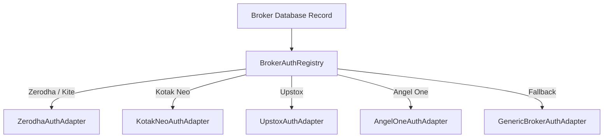

# Broker Management & Authentication

The Broker Management subsystem handles all credentials, OAuth connections, scheduling, and feature flags for the supported trading accounts. It is driven by the Django Admin interface, a modernized mobile-friendly token manager, and a pluggable authentication adapter architecture (`kalai.auth`). It relies on PostgreSQL `pg_notify` signals to immediately propagate changes to running backend engines.

---

## 1. Core Models (`kalai/models.py`)

### `BrokerType` and `ApiProvider`
These models store static configurations representing brokerage firms (e.g., Zerodha, Kotak Neo, Upstox, Angel One, CoinDCX, Tradovate) and the API provider used to fetch data. They allow a decoupled setup where market data is sourced from one provider while orders are routed to another.

### `Broker`
This is the central configuration class for a user account.
- **Identity:** Maps an internal `account_id` (e.g., `HS6525`) and `name` to a specific `BrokerType`.
- **Credentials:** Stores `api_key`, `api_secret`, OAuth `access_token`, `access_token_updated_at`, `refresh_token`, and a programmatic `totp_secret`.
- **URLs & Callbacks:** Stores `redirect_url`, `base_redirect_url`, and `api_endpoint`.
- **Schedules:** Controls the time windows during which the WebSocket and Algo engines operate for this account (`ws_start_time`, `ws_stop_time`, `ws_operating_days`).

### Unified Multi-Broker Credential Mapping Matrix
To maintain an identical model interface across all brokers (including Kotak Neo, Zerodha Kite, CoinDCX, CoinSwitch PRO, Tradovate), credentials map into the standard `Broker` fields as follows:

| Broker | Account ID (`account_id`) | API Key (`api_key`) | API Secret (`api_secret`) | TOTP Secret (`totp_secret`) | Refresh Token (`refresh_token`) | Access Token (`access_token`) |
| :--- | :--- | :--- | :--- | :--- | :--- | :--- |
| **Delta Exchange** | Account ID / User ID (e.g. `73270496`) | Delta API Key | Delta API Secret (HMAC-SHA256) | — | — | — |
| **Kotak Neo** | Client ID / UCC (e.g. `W1NPY`) | **Consumer / Customer Key** | 6-digit Neo MPIN (e.g. `123456`) | 32-char TOTP 2FA Secret Key | Registered Mobile (`+91...`) | Bearer Session Token (`<token>:::<sid>`) |
| **Zerodha Kite** | Kite User ID (e.g. `HS6525`) | Kite Connect API Key | Kite Connect API Secret | 32-char TOTP Seed (2FA) | — | Daily OAuth Token |
| **CoinDCX** | Account Identifier / Email | CoinDCX API Key | CoinDCX API Secret (HMAC) | — | — | — |
| **CoinSwitch** | Account Identifier | PRO API Key | Secret Key (Ed25519/HMAC) | — | — | Optional |
| **Tradovate** | Tradovate Username | CID / App ID | App Secret / Master Password | Optional 2FA Seed | — | Bearer Access Token |

### Common `is_crypto` Property & 24/7 Continuous Execution
To maintain clean, broker-agnostic architecture across the system:
- **Common Asset-Class Property (`broker.is_crypto`)**: Instead of broker-specific flags (like `is_delta`), a single standard `is_crypto` property on `Broker` identifies all cryptocurrency broker accounts (Delta Exchange, CoinSwitch PRO, CoinDCX).
- **24/7/365 Continuous Execution**: Cryptocurrency markets never close. When a crypto account is created, `enable_schedule` defaults to `False`. The Algorithm Engine (`algo_engine`) and WebSocket scheduler (`evaluate_websocket_schedules`) run all cryptocurrency accounts 24/7 without market hour restrictions or overnight shutdowns.
- **Delta Exchange IP Restriction**: If a Delta Exchange API key has IP restrictions enabled on the Delta Exchange dashboard, the hosting server's public IP must be whitelisted, or requests will be rejected with HTTP 401 (`ip_not_whitelisted_for_api_key`). The system provides explicit diagnostic logs identifying the rejected IP.

#### Automatic Callback URL Generation (`save()`)
DeltaZero26 automatically generates deterministic, account-specific callback URLs upon account creation:
```python
def auto_populate_redirect_url(self, request=None) -> None:
    # Generates: https://<domain-or-ip>/broker-admin/callback/<account_id>/
```
- In Django Admin, this URL is computed and displayed with an instant **📋 Copy** button.

### Multi-Broker Setup & Credential Mapping Guide
DeltaZero26 provides an integrated, theme-aware Setup Guide directly in the Django Admin to assist operators in mapping broker-specific credential names into unified `Broker` model fields:

- **Access Points**:
  - **Admin Navigation Sidebar**: Direct link under the accounts module.
  - **Account Changelist**: Top toolbar button (`📘 Credential Setup Guide`) resolving via canonical ``.
  - **Add/Change Form Banner**: Auto-injected at the top of the form by `broker_admin_hints.js`.
- **Dual-Route Architecture (`get_urls`)**:
  - **Canonical URL**: `/<ADMIN_PATH>/kalai/broker/credential-guide/`
  - **Instance-Scoped URL**: `/<ADMIN_PATH>/kalai/broker/<object_id>/credential-guide/`
- **Context-Aware Return Navigation**:
  When accessed from a specific broker account's change form (`/<object_id>/credential-guide/`), `credential_guide_view` resolves the target `Broker` instance and provides a direct **"← Back to [Account Name]"** button, allowing operators to reference keys and return directly to the edit form without losing form state or navigation context.
- **Resilient URL Resolution (`broker_admin_hints.js`)**:
  Dynamic client scripts extract the base broker path from `window.location.pathname` (`/^(.*\/kalai\/broker\/)/`) to generate absolute URLs, preventing relative navigation bugs (`../credential-guide/`) from resolving to non-existent `<path:object_id>` records.

### API Secret Key Expiry Lifecycle Tracking & Alerts
For brokers requiring periodic API secret rotation (such as CoinSwitch PRO's 90-day Ed25519 key expiration), DeltaZero26 provides an integrated tracking and warning subsystem:

- **Explicit Toggle (`enable_secret_key_expiry`)**:
  - Automatically enabled for **CoinSwitch PRO** accounts upon creation.
  - Disabled by default for perpetual key brokers (**Zerodha Kite, Kotak Neo, CoinDCX, Tradovate**), preventing irrelevant expiry notices.
- **Configurable Thresholds**:
  - `secret_key_validity_days` (default: `90` days).
  - `secret_key_warn_days` (default: `7` days before expiry).
  - `api_secret_updated_at` (auto-timestamped whenever `api_secret` is created or modified).
- **Dynamic Django Admin UI (`broker_admin_hints.js`)**:
  - Dependent validity inputs (`secret_key_validity_days`, `secret_key_warn_days`, `api_secret_updated_at`) automatically reveal when checked and collapse when disabled.
  - Auto-toggles on the Add form based on selected broker type.
  - Change list displays clean status badges: 🟢 `Active (80d left)`, ⚠️ `5d left`, 🚨 `Expired`, or `—` (*Not Applicable*).
- **5-Hour Cached Warning Context Processor (`coinswitch_expiry_alerts`)**:
  - Evaluates accounts with `enable_secret_key_expiry=True` and injects actionable dashboard warning banners across admin templates with zero repetitive database overhead.

---

## 2. Multi-Account Token & State Isolation API

To eliminate any risk of cross-account data contamination or typos in table names when managing multiple accounts, the `Broker` model provides native instance methods:

```mermaid
flowchart TD
    Strategy[Trading Strategy / API View] -->|1. Resolve Account| BrokerObj[Broker.resolve('HS6525')]
    BrokerObj -->|2. get_subscribed_tokens| TokenStore[(AlgoInfo: HS6525_inst_tokens)]
    BrokerObj -->|3. set_subscribed_tokens| TokenStore
    BrokerObj -->|4. Integrity Guardrail: clean| Validation{Validates tablename == account.token_tablename}
    Validation -->|Pass| Commit[Save to DB]
    Validation -->|Fail| ValidationError[Reject with ValidationError]
```

### Key Helper Methods on `Broker`

```python
from kalai.models import Broker

# 1. Safely resolve a broker instance (eager loads related models, case-insensitive)
broker = Broker.resolve("HS6525")

# 2. Get the deterministic token tablename
print(broker.token_tablename)  # "HS6525_inst_tokens"

# 3. Read subscribed tokens strictly for this account
tokens = broker.get_subscribed_tokens()  # [256265, 408065]

# 4. Set subscribed tokens strictly for this account (Atomic & fail-safe)
broker.set_subscribed_tokens([256265, 408065, 738561])

# 5. Persist/Fetch custom algorithmic state strictly for this account
broker.set_algo_state("my_strategy_state", {"pnl": 1250.0, "position": "LONG"})
state = broker.get_algo_state("my_strategy_state")
```

### Database Integrity Guardrails (`AlgoInfo.clean()`)
* Whenever an `AlgoInfo` record ending in `_inst_tokens` is saved, the model verifies that `tablename` strictly matches `account.token_tablename`.
* Cross-linking tokens under the wrong account is rejected with a `ValidationError`.

---

## 3. Pluggable Broker Authentication Architecture (`kalai/auth/`)

DeltaZero26 isolates broker-specific authentication routines into a modular adapter registry:



### Adapters & OAuth Nonce Validation
1. **`ZerodhaAuthAdapter` (`kalai/auth/zerodha.py`)**:
   * Builds KiteConnect v3 login URLs with account-specific redirects.
   * Exchanges `request_token` for session access tokens via `KiteConnect.generate_session()`.
2. **`KotakNeoAuthAdapter` (`kalai/auth/kotak.py`)**:
   * Supports TOTP/2FA direct login and formats compound session tokens (`token:::sid`) required by Kotak HSM WebSocket feeds.
3. **`UpstoxAuthAdapter` (`kalai/auth/upstox.py`)**:
   * Implements OAuth 2.0 authorization code exchange with state token verification.
4. **`AngelOneAuthAdapter` (`kalai/auth/angel.py`)**:
   * Implements SmartAPI JWT session generation with TOTP.
5. **`BrokerAuthRegistry` (`kalai/auth/registry.py`)**:
   * Auto-resolves the adapter dynamically using `get_auth_adapter(broker)`.

---

## 4. Deterministic Multi-Account Callback Routing (`kalai/urls.py` & `views.py`)

To support multiple accounts under the same broker simultaneously without collision or session dropouts, DeltaZero26 routes callbacks deterministically:

1. **Path-Based Route**:
   ```text
   GET /broker-admin/callback/<account_id>/
   ```
   *(e.g., `/broker-admin/callback/HS6525/`)*
2. **Query-Parameter Route**:
   ```text
   GET /broker-admin/callback/?account_id=<account_id>
   ```
3. **OAuth Nonce Validation**:
   - `broker_login_view` generates a cryptographically random `oauth_state` token stored in session.
   - `broker_callback_view` checks incoming `state` parameters to prevent OAuth Login CSRF attacks.
4. **Session & Single-Account Fallback**:
   - Automatically resolves to active accounts if session context was lost during external cross-site redirects.

---

## 5. Mobile-First Token Manager Dashboard (`/broker-admin/broker-login/`)

Provides a clean, responsive web interface (`templates/admin/broker-login.html`):
* **Live Token Status Badges**:
  * 🟢 **Active (Today)**: Token was updated today (valid for market hours).
  * 🟡 **Active (<24h)**: Token was generated within the last 24 hours.
  * 🔴 **Expired / Missing**: Stale or unconfigured token.
* **One-Click Copy Callback URL**: Displays the exact URL to paste into each broker's developer console.
* **One-Click Login**: Triggers individual OAuth or TOTP session authentication per account.
* **Clean Empty State & No Mock Auto-Seeding**: When no accounts exist in the database, the dashboard displays a clean **"No broker accounts found"** card with a direct **`+ Add Account in Admin`** link without auto-inserting any dummy placeholder accounts into PostgreSQL.
* **Smart Back-to-Admin**: The **Home / Admin** button captures `return_url` / `document.referrer` to seamlessly return to your exact originating admin section in the same tab.

---

## 6. TOTP Code Generator (`/default-totp/` & `kalai/auth/totp.py`)

DeltaZero26 includes a resilient, universal TOTP subsystem shared across the web UI, API endpoints, and broker authentication adapters:

* **Automatic Network Clock Drift Compensation**: Inspects and caches HTTP server `Date` headers (from `https://kite.zerodha.com`, `https://api.kite.trade`, `https://www.google.com`, and `https://cloudflare.com`) to calculate exact second offsets. Guarantees 100% accurate OTP generation even if the host computer's clock is desynchronized.
* **Universal Base32 Secret Sanitization**: Automatically cleans raw secrets on save and generation—handling spaces (`JBSW Y3DP`), hyphens (`jbsw-y3dp`), lowercase characters, and `otpauth://totp/...` QR URI formats without throwing `binascii.Error`.
* **Filtered Selection**: Dropdown and cards exclusively display accounts with an active, configured `totp_secret`.
* **Instant Copy & Auto-Close**: Generates live 6-digit TOTP tokens with a single-click clipboard copy function and smooth modal redirect.
* **Direct Model Integration**: Any `Broker` instance can directly generate its current OTP via `broker.get_totp()`.
* **Graceful Empty State**: Displays clear guidance if no accounts have 2FA secret keys configured.

---

## 7. Security & Access Control

* **Standard Django Security Middleware**: Complete protection with `SecurityMiddleware`, `CsrfViewMiddleware`, `AuthenticationMiddleware`, and `XFrameOptionsMiddleware` (`SAMEORIGIN`).
* **Dual-Layer Access Control (`@staff_or_token_required`)**: Sensitive data synchronization endpoints (`/api/export/models/`, `/api/export/ticks/`, `/api/export/algo-logs/`) support both authenticated Django Staff sessions and machine-to-machine header tokens (`X-Server-Key` matching `DJANGO_SECRET_KEY`).
* **Staff-Only Admin Endpoints**: UI-only routes (`/fetch-totp/`, `/default-totp/`, `/api/fetch-remote-data/`) are protected with `@staff_member_required`.
* **Obfuscated Admin Path**: Default admin path uses dynamic tokens (e.g. `/d4f8g9h2j1m5k8p3/`).
* **Masked Admin Form Inputs**: `AccountAdminForm` uses `PasswordInput` widgets for `api_secret`, `totp_secret`, and `refresh_token` to prevent shoulder-surfing and DOM leaks.
* **Safe SQL Queries & Credential Isolation**: Bulk data exports (`export_ticks_api`, `export_algo_logs_api`) use parameterized `psycopg.sql.SQL` with bounded hour limits, while `export_models_api` strictly serializes `kalai.AlgoInfo` (omitting `kalai.Broker` credentials).

---

## 8. Real-time Configuration Propagation (`pg_notify`)

1. **Admin Save:** When a Broker record is updated or tokens are saved, Django fires `@receiver(post_save, sender=Broker)` on `notify_engine_on_account_save`.
2. **`pg_notify` Execution:** Sends JSON payloads via PostgreSQL channels:
   - `SELECT pg_notify('engine_control', ...)` (WebSocket ingestion engine).
   - `SELECT pg_notify('algo_control', ...)` (Algo trading engine).
3. **Hot-Reload:** Running background workers receive the notification and hot-reload their connections with zero process downtime.

---

## 9. Admin Header & Remote Synchronization Tools (`base_site.html`)

The top Django Admin header bar provides integrated remote telemetry and data management tools:

* **Horizontal Slash Breadcrumbs**: Displays clean, clickable path hierarchy (`Home / Section / Sub-section`) with no vertical numbering or bullet points.
* **Lightweight Digital Clock**: 1-second interval clock updates avoiding client CPU thrashing.
* **Unified Action Group** (in `DEBUG_MODE`):
  - **Shared Hours Box**: A single numerical input specifying the time window (default: `24` hours).
  - **`Fetch Data`**: Connects to `https://{REMOTE_DB_HOST}` to stream and synchronize ticks (`kalai_processedtickstore`), models (`kalai_algoinfo`), and structured logs (`kalai_algolog`) into the local development database via high-speed PostgreSQL `COPY`.
  - **`Export Logs`**: Retrieves recent algorithm logs, parses telemetry metrics (`Balance_Rs`, `Open_Positions`, `Orders_Count`, `Execution_Time_s`), and downloads a structured 4-sheet Excel report (`All_Logs`, `Account_Telemetry`, `Errors_&_Warnings`, `Summary`).

---

## 10. Account Safety Guardrails & Disaster Recovery

### Active Pre-Delete Signal Guard (`tests/conftest.py`)
To prevent test suites or operational scripts from inadvertently deleting live accounts:
```python
PROTECTED_LIVE_ACCOUNTS = {"73270496", "W1NPY", "HS6525", "Prvn_coinswitch"}

@receiver(pre_delete, sender=Broker)
def protect_live_brokers_from_deletion(sender, instance, **kwargs):
    if instance.account_id in PROTECTED_LIVE_ACCOUNTS:
        raise RuntimeError(
            f"CRITICAL SAFETY VIOLATION: Test attempted to delete live production broker account "
            f"'{instance.account_id}' ({instance.name})! Operation blocked."
        )
```
Any execution attempting to delete production accounts will raise an immediate, hard `RuntimeError`.

### PostgreSQL Heap Page Credential Recovery (`pageinspect`)
Under PostgreSQL's MVCC architecture, `DELETE` statements do not physically zero out disk blocks; tuples are simply flagged as dead until a `VACUUM FULL` is issued. If accounts are deleted accidentally, full credentials, API secrets, tokens, and TOTP seeds can be extracted directly from physical table heap pages using the standard `pageinspect` extension:
```sql
SELECT tuple_data_split('kalai_broker'::regclass, t_data, t_infomask, t_infomask2, t_bits)
FROM heap_page_items(get_raw_page('kalai_broker', 0))
WHERE t_data IS NOT NULL;
```
A reference restoration script is maintained in `scratch/restore_live_brokers.py` to re-seed `BrokerType`, `ApiProvider`, and reconstruct all 4 broker records with preserved primary keys (`656`, `70`, `7`, `71`) and foreign key relationships.

### Numeric Stream Table Quoting (`"{account_id}_stream_kv"`)
When running raw SQL queries against per-broker stream tables (such as `stream_tbl = f"{account_id}_stream_kv"`), the table identifier must always be wrapped in double quotes:
```python
cur.execute(f'SELECT data, timestamp FROM "{stream_tbl}" ORDER BY timestamp DESC LIMIT %s;', [min(limit, 500)])
```
Without double quotes, PostgreSQL parses account IDs that begin with digits (e.g. Delta Exchange user ID `73270496`) as numeric literals with invalid trailing text (`ERROR: trailing junk after numeric literal`), crashing the query.

