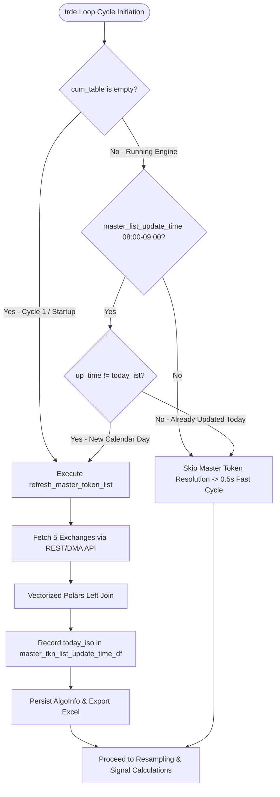

# CoinSwitch PRO Polars Monolithic Options Engine

The **CoinSwitch PRO Polars Options Engine** ([`algo_trading/algos/coinswitch_opt_trde_polars.py`](file:///c:/Users/Admin/Documents/deltazero26/algo_trading/algos/coinswitch_opt_trde_polars.py)) is a high-performance, Polars-native algorithmic trading engine engineered for 24/7 crypto options, perpetual futures, and spot markets.

---

## 1. Core Architecture & Design

```mermaid
flowchart TD
    ConfigExcel[token_ref_bitcoin.xlsx] --> InitEngine[TradeAlgo.__init__]
    CoinSwitchAPI[CoinSwitch PRO REST / DMA APIs] --> InstFetch[CoinSwitchUtility.get_all_instruments]
    
    InitEngine --> MasterTknList[TradeAlgo.master_tkn_list]
    InstFetch --> MasterTknList
    
    subgraph Polars Vectorized Assembly [Vectorized Polars Joining]
        MasterTknList --> AugTable[self.aug_table (Filtered Crypto Underlyings)]
        MasterTknList --> MasterSheets[5 Exchange Sheets: coinswitchx, c2c1, c2c2, FUTURES, OPTIONS]
        MasterSheets --> UnifiedDerivatives[self.nfo_cds_mcx (Concat All Instruments)]
        AugTable -- Left Join on Symbol == name --> CumTable[self.cum_table (Derivatives & Spot Contracts)]
    end
    
    CumTable --> StreamSync[DB Token Subscriptions: {account}_inst_tokens]
    StreamSync --> WSEngine[CoinSwitch WebSocket Feed]
    WSEngine --> ProcessedTickStore[(ProcessedTickStore DB)]
    
    subgraph Sub-Second Execution Loop [24/7 Cycle Loop]
        ProcessedTickStore --> TickNormalize[Polars Fast Tick Ingestion]
        TickNormalize --> MultiResample[8-Timeframe Candle Resampler]
        MultiResample --> HeikinAshi[Vectorized Heikin-Ashi Indicator Engine]
        HeikinAshi --> StrikeEval[Dynamic Strike & Jump Evaluator]
        StrikeEval --> OrderRouter[CoinSwitch DMA & REST Execution]
    end
```

---

## 2. Key Capabilities & Differences from Equity Engines

| Feature | Equity Engines (Zerodha / Kotak) | CoinSwitch PRO Crypto Engine |
| :--- | :--- | :--- |
| **Market Hours** | 09:15 – 15:30 IST (Mon–Fri) | **24/7 Continuous Trading (365 days/year)** |
| **Asset Configuration** | `token_ref.xlsx` (`nfo_config`, `nfo_list`) | **`token_ref_bitcoin.xlsx` (`bit_config`, `bit_list`)** |
| **Instrument Universe** | NSE / NFO / MCX / CDS / BFO | **coinswitchx (INR), c2c1 (USDT), c2c2, FUTURES, OPTIONS** |
| **Option Protocol** | Broker Order Routing (Kite / Neo REST) | **CoinSwitch DMA Options API (`https://dma.coinswitch.co`)** |
| **Authentication** | OAuth 2.0 / TOTP 2FA Session Bearers | **Zero-Trust Ed25519 Cryptographic Signatures** |
| **Wallet Balance** | Segmented Cash & Collateral Margins | **Unified DMA Wallet Balance (`accountType=UNIFIED`)** |
| **Stop Loss Trailing** | Afternoon Session (12:45 – 15:30 IST) | **Nightly Window (`sl_update_time`: 01:30 – 01:31 AM IST / Continuous in Debug)** |
| **Token Validity** | Daily Interactive Login / Expiration Check | **Persistent Ed25519 Keys (No Token Expiry Check)** |

### 24/7 Continuous Crypto Decoupling & Timing Architecture
Because crypto markets never close, legacy Indian equity exchange logic copied from equity engines (`zerodha_opt_trde_reference.py` / `kotak_opt_trde_polars.py`) is bypassed:
- **No Token Validity Gate**: CoinSwitch uses persistent Ed25519 public/private keys; `is_token_valid_today()` is bypassed without blocking live trading.
- **No Order Placing or Standby Gates**: Timing checks (`check_for_orderplacing_time`, `initialising_time`, `is_mkt_day`) are disabled in `main()`, allowing the engine to start immediately at any time of day or night.
- **Dynamic Daily Master Token Refresh**: The master token list is resolved on cycle 1 if empty, and refreshes dynamically inside the `trde()` loop during `master_list_update_time()` (08:00–09:00 IST) or on calendar date rollovers without restarting the process.
- **Stop Loss Trailing Window (`sl_update_time`)**: Configured for 01:30 – 01:31 AM IST (and always active in `--debug` mode), trailing stop losses upwards when live LTP exceeds registered entry stop losses.
- **Session Start & Rollover (`session_start`)**: Synchronized with UTC daily rollover (05:30 – 06:30 AM IST).
- **Unified Candle Resampling**: In `update_all_candles_batch`, all crypto tokens resample continuously in a single pass without splitting into equity exchange origins (`MCX`/`CDS` at 9:00 AM vs `NSE` at 9:15 AM).
- **Exchange Identifier Usage**: The `exchange` field in CoinSwitch is used strictly for routing orders to the correct API endpoint (`coinswitchx` for INR spot, `c2c1` for USDT spot, `EXCHANGE_2` for Perpetual Futures, and `OPTIONS` for DMA Options).

---

## 3. Configuration Specification (`token_ref_bitcoin.xlsx`)

The engine consumes configuration from [`algo_trading/algos/token_ref_bitcoin.xlsx`](file:///c:/Users/Admin/Documents/deltazero26/algo_trading/algos/token_ref_bitcoin.xlsx):

### A. `bit_config` (Algorithm Control Parameters)
| Parameter Key | Example Value | Description |
| :--- | :--- | :--- |
| `debounce_counter_threshold` | `0` | Consecutive signal counter required before triggering an order. |
| `Buy_TTL_value` | `1` | Time-to-live (cycles/seconds) for active buy orders. |
| `Sell_TTL_value` | `1` | Time-to-live for active sell orders. |
| `hedge_counter` | `0` | Threshold multiplier for automated delta-neutral hedging. |
| `capital_allowed` | `500,000,000` | Maximum total account capital allocation. |
| `stoploss_counter` | `0` | Loss percentage threshold for automated risk mitigation. |

### B. `bit_list` (Underlying Asset Definitions)
| Symbol | Ref_stock | Nifty_index | Capital_share | Max_capital_CE | Max_capital_PE | Max_lots_per_order | Multiplier | Scan_window | Cap_info |
| :--- | :--- | :--- | :--- | :--- | :--- | :--- | :--- | :--- | :--- |
| `BTC` | `BTC` | `BTC` | `0` | `0` | `0` | `0` | `1` | `7200` | `monthly_options` |
| `ETH` | `ETH` | `ETH` | `1` | `5000` | `5000` | `1` | `1` | `7200` | `monthly_options` |

### C. `stoploss_tbl` & `derloss_tbl`
Multi-level header stop loss matrix and derivative decay matrices used for real-time risk assessment during open positions.

### D. `bit_holiday_info`
Calendar dates for special maintenance windows (empty by default for 24/7 crypto markets).

---

## 4. Multi-Exchange Master Token Resolution (`master_tkn_list`)

The engine communicates with CoinSwitch PRO REST and DMA endpoints to gather all tradable instruments across 5 distinct exchanges:

1. **`coinswitchx` (INR Spot)**: Indian Rupee spot pairs (e.g. `BTC/INR`, `ETH/INR`).
2. **`c2c1` (USDT Spot)**: Liquid Tether spot pairs (e.g. `BTC/USDT`, `ETH/USDT`).
3. **`c2c2` (High-Liquidity USDT Spot)**: Secondary institutional liquidity pool pairs.
4. **`FUTURES` (`EXCHANGE_2`)**: Perpetual Futures derivative contracts (e.g. `BTCUSDT`, `ETHUSDT`) with up to 50x leverage.
5. **`OPTIONS` (CoinSwitch DMA)**: Live European call and put options (e.g. `BTC-04SEP26-75500-CE`, `ETH-04SEP26-2500-PE`).

### Underlying Reference Pair Resolution Architecture (`Ref_stock` & `Index_tkn`)
In multi-exchange crypto markets, a base underlying asset (e.g., `ETH` or `BTC`) exists across multiple trading pairs (`ETH/BTC`, `ETH/USDC`, `ETH/USDT`, `ETH/INR`). To ensure options and derivative strikes match the high-liquidity market ticks streamed via WebSockets, `master_tkn_list` applies a cascading priority lookup:

1. **Exact Pair Match**: If `Ref_stock` in `token_ref_bitcoin.xlsx` is explicitly specified as a pair string (e.g., `BTC/USDT`), `(pl.col('tradingsymbol') == ref_sym)` matches it directly.
2. **USDT Spot Priority**: If `Ref_stock` is a base asset symbol (e.g. `ETH`), `(pl.col('name') == ref_sym) & (pl.col('tradingsymbol').str.ends_with('/USDT'))` binds to the primary USDT spot pair (e.g., `ETH/USDT` token `519679068`), avoiding non-USDT cross-pairs (`ETH/BTC` or `BTC/USDC`).
3. **Generic Base Asset Fallback**: `(pl.col('name') == ref_sym)` falls back to any available spot pair in `c2c1_inst_data`.
4. **Perpetual Futures Fallback**: If no spot contract exists, `futures_inst_data` matches perpetual futures contracts (`BTCUSDT`, `ETHUSDT`).
5. **CRC32 Synthetic Hashing**: If unregistered, computes a deterministic 32-bit CRC32 token (`str_to_token`).

```python
# Cascading Spot & Reference Token Matching
spot_match = pl.DataFrame()
if not self.c2c1_inst_data.is_empty():
    for match_expr in [
        (pl.col('tradingsymbol') == ref_sym),
        (pl.col('name') == ref_sym) & (pl.col('tradingsymbol').str.ends_with('/USDT')),
        (pl.col('name') == ref_sym)
    ]:
        m = self.c2c1_inst_data.filter(match_expr)
        if not m.is_empty():
            spot_match = m
            break
```

This guaranteed alignment ensures `self.tick_data.filter(pl.col('instrument_token') == token_number)` in `mom()` perfectly synchronizes with live incoming ticks, satisfying `has_session_data` and `has_index_data` for quantitative momentum and jump evaluations.

### Vectorized Polars Left-Join Pattern
Instead of allocating memory in Python loops, `master_tkn_list` runs in milliseconds using Polars:
```python
# Filter active underlying assets from Excel
active_aug = raw_aug.filter(cap_filter & lots_filter & tradable_filter)

# Match available derivative and spot instruments
matched_inst = self.nfo_cds_mcx.filter(pl.col('name').is_in(aug_stocks))

# Vectorized Left Join
cum_joined = matched_inst.join(
    self.aug_table,
    left_on='name',
    right_on='Symbol',
    how='left'
)
```

---

## 5. Master Token Resolution Lifecycle & In-Memory Gating

To maximize throughput and maintain sub-second loop execution, `master_tkn_list` resolution is dynamically gated in [`TradeAlgo.trde()`](file:///c:/Users/Admin/Documents/deltazero26/algo_trading/algos/coinswitch_opt_trde_polars.py#L4091-L4115):



1. **Cycle 1 (Initial Startup)**: `cum_table` is empty, immediately executing `refresh_master_token_list()` to fetch live instruments, assemble `self.cum_table`, and record the current date in `self.master_tkn_list_update_time_df`.
2. **Subsequent Real-Time Cycles**: Because `cum_table` is populated and `master_list_update_time()` is outside the morning window, master token resolution is completely bypassed. Loop cycle execution drops from ~4.5s down to **0.45s – 0.75s**.
3. **Daily Scheduled Rollover (08:00 – 09:00 AM IST)**: When `today_ist()` advances to a new calendar day, the gate triggers once at 08:00 AM, updates instruments, and resets the in-memory timestamp.

---

## 6. Sub-Second Trading Cycle Execution (`trde()` Loop)

The engine executes on a 2.0-second timer budget, averaging **0.45s – 0.60s** per full multi-asset cycle:

1. **Daily Master Token Resolution Gate**: Checks `self.cum_table.is_empty()` or `master_list_update_time()`, updating in-memory lookup maps without restarting the process.
2. **Tick Buffer Ingestion**: Fetches recent delta ticks and merges into rolling buffer (`self.tick_data`), sorting by `date_time`.
3. **Single-Pass Macro Candle Resampling (`update_all_candles_batch`)**: Resamples ticks into active timeframes (1m base, 3m, 10m, 30m, 1D) with a 25-bar retention cap per token using Polars/Rust SIMD kernels.
4. **Strike Detection (`strike_detect`)**: Dynamically resolves active ATM, ITM, and OTM strike option contracts from underlying prices.
5. **Token List Assembly (`token_list_update`)**: Updates instrument subscriptions for live WebSocket streaming.
6. **Zero-Overhead Signal Evaluation (`mom`)**: Slices pre-resampled candle buffers per underlying token without redundant re-resampling, evaluating directional signals (`sig_ce`, `sig_pe`), jump exits, and debounce counters.
7. **Order Execution & Risk Checks**:
   - Spot & Perpetual Orders $\rightarrow$ Routed via CoinSwitch PRO v2 API.
   - Option Contracts $\rightarrow$ Routed via CoinSwitch DMA v5 API (`v5/order/create`).
8. **Telemetry & Log Flushing**: Buffers execution metrics in memory and periodically flushes to `kalai_algolog` via `flush_if_needed()`. On `--debug` termination (5-iteration cap), exports fresh multi-sheet Excel workbooks (`cum_table.xlsx`, `Master_inst_token.xlsx`, `algo_logs_export.xlsx`).

---

## 7. Execution & Verification

Run the CoinSwitch Polars engine directly in debug mode:
```powershell
.venv\Scripts\python.exe algo_trading/algos/coinswitch_opt_trde_polars.py
```

Execute automated unit tests:
```powershell
.venv\Scripts\python.exe -m pytest tests/test_coinswitch_opt_trde_polars.py tests/test_coinswitch_utils.py tests/test_coinswitch_feed.py -v
```
