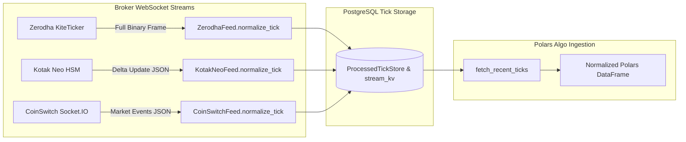

# WebSocket Engine

The WebSocket Engine is an asynchronous, highly-concurrent pipeline responsible for connecting to broker APIs, ingesting real-time tick data, and persisting it to the PostgreSQL database. 

---

## 1. Flowchart & Architecture

```mermaid
flowchart TD
    subgraph WSEngine [WebSocket Engine (asyncio)]
        DBPool[(asyncpg Pool)]
        Registry[Broker Registry]
        SharedLogQueue[[Shared Log Queue]]

        Registry -- Discovers --> FeedZ[Zerodha Feed]
        Registry -- Discovers --> FeedK[Kotak Neo Feed]
        Registry -- Discovers --> FeedCS[CoinSwitch Feed]
        Registry -- Discovers --> FeedC[CoinDCX Feed]
        Registry -- Discovers --> FeedT[Tradovate Feed]

        subgraph Pipeline1 [Isolated Pipeline: Zerodha]
            FeedZ -- Reads Subscriptions --> AlgoInfoZ[AlgoInfo: HS6525_inst_tokens]
            FeedZ -- Pushes Raw Ticks --> QueueZ[[Tick Queue]]
            QueueZ -- Reads --> ConsumerZ(Tick Consumer Task)
        end

        subgraph Pipeline2 [Isolated Pipeline: Kotak Neo]
            FeedK -- Reads Subscriptions --> AlgoInfoK[AlgoInfo: KOTAK01_inst_tokens]
            FeedK -- Pushes Raw Ticks --> QueueK[[Tick Queue]]
            QueueK -- Reads --> ConsumerK(Tick Consumer Task)
        end

        subgraph Pipeline3 [Isolated Pipeline: CoinSwitch]
            FeedCS -- Reads Subscriptions --> AlgoInfoCS[AlgoInfo: CS_USER_inst_tokens]
            FeedCS -- Pushes Normalized Ticks --> QueueCS[[Tick Queue]]
            QueueCS -- Reads --> ConsumerCS(Tick Consumer Task)
        end

        ConsumerZ -- Binary COPY --> DBPool
        ConsumerK -- Binary COPY --> DBPool
        ConsumerCS -- Binary COPY --> DBPool
        
        FeedZ -- Logs --> SharedLogQueue
        FeedK -- Logs --> SharedLogQueue
        FeedCS -- Logs --> SharedLogQueue
        
        SharedLogQueue -- Reads --> LogConsumer(Log Consumer Task)
        LogConsumer -- Binary COPY --> DBPool
    end
```

---

## 2. Code Flow: Under the Hood

The engine is primarily orchestrated by `run_engine()` in [`algo_trading/brokers/engine.py`](file:///home/prvn/Documents/githubproj/deltazero26/algo_trading/brokers/engine.py).

### A. Initialization and Connection Pooling
- The engine creates a high-performance `asyncpg` connection pool strictly used for asynchronous, non-blocking inserts into the database. Django's synchronous ORM is avoided in the hot tick-ingestion path to eliminate thread-blocking.

### B. Isolated Pipeline Creation (`start_account_pipeline`)
For every enabled feed returned by `BrokerRegistry` (e.g. Zerodha, Kotak Neo, CoinSwitch, CoinDCX, Tradovate), the engine creates a fully isolated pipeline:
- **`asyncio.Queue`**: Configured with a `maxsize` to prevent memory bloat.
- **Feed Task**: Runs the broker-specific websocket logic (handling authentication, subscription frames, and raw JSON tick streaming).
- **Consumer Task (`tick_consumer`)**: Continuously batches ticks and executes high-speed binary `copy_records_to_table` into `{safe_account_name}_stream_kv` (weekly partitioned) and `kalai_processedtickstore`. Table naming is determined deterministically by `get_broker_stream_table_name(account_id)`, prefixing numeric accounts with `b_` (e.g. `b_73270496_stream_kv`) for SQL identifier compatibility.
- **In-Memory Caching & Performance**:
  - `_ensured_partitions`: Caches verified weekly table partitions in memory to avoid repetitive `SELECT ensure_weekly_partition(...)` SQL queries on every flush.
  - `_broker_ids`: Caches resolved and negative account foreign keys to eliminate repeated database roundtrips during high-throughput tick processing.


By isolating pipelines per account, a crash or reconnect event on one broker will never impact data ingestion on other accounts.

### C. Per-Symbol Rate Limiting (`BaseFeed.enqueue_tick`)
To manage tick ingestion volume while preventing multi-instrument starvation, `BaseFeed` implements granular **per-symbol rate limiting**:
- **Per-Symbol Timestamp Tracking**: Replaces global feed-level throttling (`_last_tick_time: float`) with dedicated per-symbol slot tracking (`self._last_tick_times: dict[str, float] = {}`).
- **Slot Key Resolution**: Dynamically extracts the instrument identifier:
  ```python
  sym_key = str(tick.get("tradingsymbol") or tick.get("symbol") or tick.get("instrument_token") or "default")
  ```
- **Independent 100ms Rate Limit Gate**: Ticks for each symbol are throttled independently (`(now - last_time) >= min_interval`, default 100ms / 10 ticks per second per symbol).
- **Multi-Asset Starvation Prevention**: In multi-underlying deployments (such as `token_ref_bitcoin.xlsx` with BTC, ETH, SOL, XRP, or Indian markets with NIFTY, BANKNIFTY, FINNIFTY), ultra-high-frequency trades on primary symbols (e.g., BTC trade stream arriving every 5ms) can no longer saturate the rate limiter and starve lower-volume symbols. Every underlying and active option strike maintains guaranteed ingestion throughput into `kalai_processedtickstore`.

---

## 3. Stream Data Formats Across Brokers

Different brokers use distinct transport protocols and packet structures. DeltaZero26 standardizes tick ingestion while preserving raw broker telemetry:



### A. Zerodha (`ZerodhaFeed` / `KiteTicker`)
* **Protocol**: Synchronous Twisted reactor over WebSocket (`wss://ws.kite.trade`).
* **Packet Type**: Full binary frames decoded into complete dictionary structures containing `instrument_token`, `last_price`, `volume_traded`, `oi`, `ohlc`, `depth`, and `exchange_timestamp`.
* **Behavior**: Every tick delivers a full snapshot for that token.
* **Token Subscriptions**: Uses native integer tokens directly (`ws.subscribe([256265, ...])`).

### B. Kotak Neo (`KotakNeoFeed` / `HSWebSocket`)
* **Protocol**: Binary HSM (High Speed Market data) WebSocket (`wss://mlhsm.kotaksecurities.com`).
* **Differential Delta Streaming**:
  1. **`SNAP` (Snapshot)**: Sent once upon subscription, containing full scrip metadata.
  2. **`UPDATE` (Delta Updates)**: Transmits **only fields that changed** in that millisecond to maximize throughput.
* **Feed Packet Types (`name`)**:
  * **`sf` (Scrip Feed)**: Equities, Futures, Options contracts.
    * Changed fields may include `ltp` (Last Traded Price), `sp` (Best Ask), `bp` (Best Bid), `bq` (Bid Quantity), `bs` (Ask Quantity), `tbq` (Total Buy Quantity), `tsq` (Total Sell Quantity), `fdtm` (Feed Date Time), `v` (Volume), `oi` (Open Interest), `ap` (VWAP), `c` (Close).
    * *Note*: If order book quantities change without an executed trade, `ltp` is omitted and only `sp`/`bp` or `tbq`/`tsq` are sent.
  * **`if` (Index Feed)**: Market Indices (e.g. NIFTY 50, BANKNIFTY).
    * Price level is transmitted under **`iv` (Index Value / LTP)**, with close price under `ic`.
  * **`dp` (Depth Feed)**: 5-level market depth (`bp`/`bp1`-`bp4`, `sp`/`sp1`-`bp4`, `bq`/`bq1`-`bq4`, `bs`/`bs1`-`bs4`).
* **Dynamic Segment Mapping & `ExchangeMasterData` Integration (`_refresh_segment_cache`)**:
  * Kotak Neo requires scrip formatting as `<segment>|<token>` (e.g. `nse_fo|35001`, `mcx_fo|568246`, `bse_cm|500325`).
  * `KotakNeoFeed._refresh_segment_cache()` automatically inspects both `ExchangeMasterData` (`cum_table`, `aug_table`, `mcx_instrument_data`) and `AlgoInfo` across account and global tables.
  * Ensures MCX Commodity contracts (e.g. `NATGASMINI25SEP26FUT` with token `568246`) and BSE contracts are correctly prefixed (`mcx_fo|568246`, `bse_cm|...`) instead of defaulting to `nse_fo|...`.

### C. CoinSwitch PRO (`CoinSwitchFeed` / Socket.IO v4)
* **Protocol**: Socket.IO v4 namespaces (`/coinswitchx`, `/c2c1`, `/c2c2`).
* **Packet Type**: JSON market events (`FETCH_ORDER_BOOK_CS_PRO`, `FETCH_TRADES_CS_PRO`, `FETCH_TICKER_CS_PRO`, `orderbook`, `trades`).
* **Underlying Pair Extraction & Deduplication (`extract_coinswitch_pair`)**:
  * CoinSwitch PRO Socket.IO streams spot trading pairs (`BASE,QUOTE` format like `BTC,INR`, `BTC,USDT`).
  * When option contracts (e.g. `BTC-25SEP26-80000-P-USDT`) are passed in `instrument_tokens`, `extract_coinswitch_pair()` automatically extracts the underlying spot pair (`BTC,USDT`) and deduplicates subscriptions.
  * Collapses hundreds of option strikes into clean underlying benchmark pairs with single-batch event emission, preventing socket flooding and rate-limit disconnects.
* **Deterministic Token Mapping**: String pairs (e.g. `BTC/USDT`, `ETH,INR`) are mapped to consistent 32-bit positive integer tokens using `str_to_token(symbol)` (CRC-32 modulo $10^9$) matching both the feed engine and Polars strategy indexing.

### D. Delta Exchange (`DeltaExchangeFeed`)
* **Protocol**: Real-time async WebSocket (`wss://public-socket.india.delta.exchange` for Delta India, `wss://socket.delta.exchange` for Delta Global).
* **Channels**: Subscribes to `v2/ticker` (or `ticker`), `all_trades`, and `l2_orderbook`.
* **Bounded Batch Chunking (50 Symbols per Frame)**:
  * When accounts hold large option universes (e.g. 500+ active option strikes), `DeltaExchangeFeed._subscribe()` and `_unsubscribe()` chunk requests into bounded batches of 50 symbols.
  * Eliminates payload buffer overflow and ensures complete subscription registration across WebSocket gateway connections.
* **Deterministic Token Mapping**: Maps contract tradingsymbols (e.g. `C-BTC-100000-260924`, `BTCUSD`) into positive 32-bit integers using CRC-32 hashing, aligning with `ExchangeMasterData` and Polars strategy indexing.

### E. CoinDCX (`CoinDCXFeed`)
* **Protocol**: Native Socket.IO client streaming from `https://stream.coindcx.com`.
* **Channels & Events**: Subscribes to market depth and trade ticks for crypto spot and derivatives pairs (`B-BTC_USDT`, `I-BTC_INR`), converting raw prices, buy/sell volumes, and bid/ask spreads into normalized Polars tick format.

---

## 4. Feed Auto-Discovery, Dual-Key Resolution & Aliases

`BrokerRegistry` dynamically discovers and maps WebSocket feed classes for all enabled accounts in Django Admin:

### A. Dual-Key Resolution Fallback
In Django Admin, an operator might configure an account selecting either the **API Provider** (`api_provider.code`) or the **Broker Platform** (`broker_name.code`). To eliminate silent skips or configuration mismatches, `BrokerRegistry._get_enabled_feeds_sync` performs a two-tier dual-key resolution:

```python
broker_name_code = (broker_obj.broker_name.code if broker_obj.broker_name else "").lower()
feed_cls = self._feed_classes.get(api_provider) or self._feed_classes.get(broker_name_code)
```

If `api_provider` is unset or not recognized, the registry immediately falls back to `broker_name_code`.

### B. Registered Feed Aliases
Each feed class declares canonical identifiers and supported aliases:

| Broker / Provider | Primary Key | Supported Aliases (`ALIASES`) |
| :--- | :--- | :--- |
| **Zerodha Kite** | `zerodha` | `kite`, `zerodha_kite` |
| **Kotak Neo** | `kotak_neo` | `kotak` |
| **CoinSwitch PRO** | `coinswitch` | `coinswitch_pro`, `coinswitchx` |
| **Delta Exchange** | `delta` | `delta_india`, `delta_exchange`, `deltaexchange`, `delta_feed` |
| **CoinDCX** | `coindcx` | `coindcx_pro`, `coindcx_futures`, `coindcx_api` |

---

## 5. Initial Setup Flow & Engine Conflict Prevention

To prevent startup race conditions, resource contention, and reactor crashes between the **WebSocket Engine** and the **Algorithmic Trading Engine**, DeltaZero26 implements strict architectural separation:

### A. Twisted Reactor Isolation (Zerodha)
* **The Conflict**: The Zerodha `KiteTicker` library runs on the Twisted reactor. Starting multiple `KiteTicker` instances or attempting to restart the reactor within the same process raises `ReactorAlreadyRunning` or `ReactorNotRestartable`.
* **Resolution**: The WebSocket engine (`ZerodhaFeed`) is the **sole owner** of the live `KiteTicker` stream. The algorithm engine (`zerodha_opt_trde_polars.py`) **never** instantiates a `KiteTicker`; it executes order routing via REST (`ZerodhaUtility`) and reads tick bars asynchronously from PostgreSQL `ProcessedTickStore` via `fetch_recent_ticks()`.

### B. Startup "Chicken-and-Egg" Token Synchronization
* **The Scenario**: When the WebSocket engine starts on a fresh day or reboot before the Algo Engine has completed pre-market strike calculations, `{account_id}_inst_tokens` in `AlgoInfo` may be empty.
* **Resolution**:
  1. **Pre-Seeded Defaults**: Crypto feeds like `CoinSwitchFeed` define `DEFAULT_INSTRUMENT_TOKENS = ["BTC,INR", "BTC,USDT", "ETH,INR", "ETH,USDT"]` to immediately stream liquidity data at boot.
  2. **Dynamic Live Re-Subscription**: When the strategy engine initializes (e.g. at 08:45 or startup) and resolves `master_tkn_list()`, it calls `broker.set_subscribed_tokens(tokens)`. The WebSocket engine's background token watcher (`_token_refresh_loop`, interval: 5s) detects the change and triggers `on_tokens_changed()` to dynamically subscribe to all strikes on the live socket without dropping the connection.

### C. Credential Freshness & Dynamic Hot Reload (`pg_notify`)
* **Session Validation**: For brokers requiring daily authentication (`access_token_required = True` for Zerodha and Kotak Neo), the WebSocket registry verifies `access_token_updated_at == today`. Stale tokens from previous dates are skipped to avoid API lockouts. Skips are logged once per account per calendar day to avoid log pollution during background polling.
* **In-Process Hot Reload**: When an operator logs in via the Django Admin OAuth/2FA flow, the `Broker.save()` signal emits a PostgreSQL `NOTIFY` on channel `engine_control`. The running engine dynamically reloads that account's pipeline in memory (`_handle_reload`) without process termination, preserving uninterrupted streaming on all other active feeds (e.g. 24/7 crypto).

---

## 5. Strict Standard Token Subscription Format

All broker feeds adhere strictly to **one universal token subscription format**:

### A. Table Name Standard
```text
{account_id}_inst_tokens
```
*(e.g., `HS6525_inst_tokens`, `KOTAK_USER_1_inst_tokens`, `PR45134584_inst_tokens`)*

### B. Tabledata JSON Standard
```json
{
  "tokenid": [ ... ]
}
```

| Broker Feed | Identifier Type | Example `tokenid` Payload |
|---|---|---|
| **Zerodha** | Integer Token IDs | `[256265, 408065, 738561]` |
| **Kotak Neo** | `exchange\|token` Strings | `["nse_cm\|11536", "nse_fo\|35001"]` |
| **CoinSwitch** | Symbol Strings / CRC Tokens | `["BTC/INR", "BTC/USDT", "ETH/INR"]` |
| **CoinDCX** | Socket.IO Channels | `["B-BTC_USDT@orderbook@20", "B-BTC_USDT@trade"]` |
| **Tradovate** | Symbol Strings | `["ESM4", "NQM4"]` |

### C. Dynamic Token Refresh Loop (`_token_refresh_loop`)
Feeds periodically read `{account_id}_inst_tokens` every `TOKEN_REFRESH_INTERVAL = 5.0` seconds. When changes occur, `on_tokens_changed()` dynamically re-subscribes tokens on the live WebSocket stream without dropping the connection.

---

## 6. Dynamic In-Process Reconfiguration & Resilient Architecture

The engine binds to a PostgreSQL `LISTEN` channel named `engine_control` and employs dual-redundancy in-memory lifecycle management:

### A. Event-Driven Dynamic Dispatching (`on_engine_control`)
When an administrator saves a Broker configuration, updates a token, or toggles active feeds in Django Admin:
- **`action == "stop"`**: Invokes `stop_account_pipeline(account_id)` to cancel only that account's feed and consumer tasks. Other brokers (e.g., 24/7 Delta Exchange or CoinSwitch streams) remain 100% unaffected.
- **`action == "start"`**: Launches `start_account_pipeline(feed)` in-process, or hot-reloads it if already running to pick up the updated access token.
- **`action in ("restart", "reload")`**: Seamlessly cleans up the old pipeline and initializes the new pipeline in place.
- **Zero Process Termination**: The engine never invokes process suicide (`os.kill(..., signal.SIGTERM)`), preventing container cascading restart loops.

### B. Zero-Feed Standby Mode (Lockout Prevention)
If no broker accounts are active at boot time or after market close (e.g. over weekends or before morning login):
- The engine does **not** exit with `return`.
- It logs an informational standby warning and keeps its PostgreSQL connection, NOTIFY event listener, log consumer, and background reconciler continuously running in the healthy `RUNNING` state under Supervisord.
- Eliminates Supervisord `FATAL` restart penalties completely.

### C. Automatic Feed Reconciler Loop (`reconcile_feeds_loop`)
A background task runs every 30 seconds (`await asyncio.sleep(30)`):
1. **Auto-Start**: Detects newly enabled accounts or accounts that just received valid today's tokens in the database and spins up their pipelines automatically.
2. **Auto-Reload**: Detects updated access tokens or modified instrument tokens and reloads the pipeline.
3. **Auto-Stop**: Stops pipelines for accounts that were deactivated in the database.
4. **Self-Healing**: Detects tasks that terminated due to unexpected network errors and automatically restarts them.

### D. 24/7 Crypto Scheduler Guarantee
In `kalai.tasks.evaluate_websocket_schedules`, all cryptocurrency broker accounts (`is_crypto=True` and `enable_trade=True`) are guaranteed to maintain `enable_websocket=True` around the clock, even if `enable_schedule=False`.

---

## 7. Background Maintenance (`clear_old_logs_and_ticks_loop`)
An automated asynchronous task runs at midnight:
- Executes raw SQL `DELETE` queries to prune records from `system_logs` and `kalai_processedtickstore` older than the configured retention periods (`TICK_RETENTION_DAYS`, `SYSTEM_LOG_RETENTION_DAYS`).

---

## 8. Operational Telemetry & Log Inspection

In the production container monolith, `ws_engine` runs under Supervisord with standard container log routing (`stdout_logfile=/dev/stdout`, `stderr_logfile=/dev/stderr`).

> [!NOTE]
> Running `docker exec -it algo_trading_monolith supervisorctl tail -50 ws_engine` returns `ws_engine: ERROR (unknown error reading log)` because Supervisord delegates log retention directly to Docker's standard output streams rather than local disk files.

### Recommended Log Inspection Commands

```bash
# 1. Live stream container standard output (includes ws_engine startup, handshakes, and errors)
docker logs --tail 50 -f algo_trading_monolith

# 2. Query high-level broker WebSocket logs directly from PostgreSQL
docker exec -it algo_trading_monolith python -c "from django.db import connection; c=connection.cursor(); c.execute('SELECT timestamp, level, broker, message FROM system_logs ORDER BY timestamp DESC LIMIT 25;'); [print(r) for r in c.fetchall()]"

# 3. Restart WebSocket engine after credential or token changes
docker exec -it algo_trading_monolith supervisorctl restart ws_engine
```

